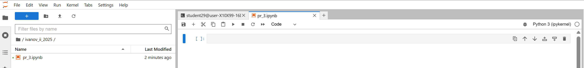

# Практическая работа №13 Машинное обучение. Logistic Regression with Python

---

## 🎯 Цель работы.

Получить теоретические знания и практические навыки постановки и решения задачи классификации методом логистической регрессии

---

## ⚠️ Важно

Это работа в формате **Notebook-based**. Вам будет доступен **ИИ-ментор** (`%%ask_mentor`). Все запросы логируются.

## 📚 Основные идеи и теоретические основы.

Логистическая регрессия – это метод классификации в машинном обучении и статистике, предназначенный для прогнозирования вероятности того, что объект принадлежит к одному из двух (бинарная классификация) или более классов. Несмотря на название, этот метод использует не линейную, а логистическую (или сигмоидную) функцию для преобразования линейной комбинации входных признаков в вероятность, которая затем интерпретируется как принадлежность к классу. 

Хотя линейная регрессия подходит для оценки непрерывных значений (например, цены дома), она не является лучшим инструментом для прогнозирования класса наблюдаемой точки данных. Чтобы оценить класс точки данных, нам необходимы некоторые ориентиры относительно наиболее вероятного класса для этой точки. Для этого мы и используем логистическую регрессию.

Логистическая регрессия соответствует специальной s-образной кривой, беря линейную регрессию и преобразуя числовую оценку в вероятность со следующей функцией, которая называется сигмоидальной функцией 𝜎

$$
ℎ_\theta(𝑥) = \sigma({\theta^TX}) =  \frac {e^{(\theta_0 + \theta_1  x_1 + \theta_2  x_2 +...)}}{1 + e^{(\theta_0 + \theta_1  x_1 + \theta_2  x_2 +\cdots)}}
$$

или:

$$
ProbabilityOfaClass_1 =  P(Y=1|X) = \sigma({\theta^TX}) = \frac{e^{\theta^TX}}{1+e^{\theta^TX}} 
$$

В этом уравнении ${\theta^TX}$ - результат регрессии (сумма переменных, взвешенных по коэффициентам), `exp` - экспоненциальная функция, $\sigma(\theta^TX)$ - сигмовидная или логистическая функция, также называемая логистической кривой. Она имеет распространённую форму буквы «S» (сигмовидная кривая).

Алгоритм находит широкое применение в таких областях, как медицина, финансы и маркетинг, для решения задач прогнозирования исходов, например, оценки риска дефолта по кредиту или определения вероятности заболевания. 

Логика работы логистической регрессии

  - Линейная комбинация: Сначала вычисляется взвешенная сумма входных признаков (независимых переменных), которая затем преобразуется в линейную комбинацию, называемую логаритом шансов (logit).
  - Логистическая функция (сигмоида): Результат линейной комбинации пропускается через логистическую функцию (или сигмоиду). Эта функция преобразует любое действительное число в значение от 0 до 1, что позволяет интерпретировать результат как вероятность.
  - Прогнозирование класса: Полученная вероятность сравнивается с заданным пороговым значением. Если вероятность выше порога, объект относится к одному классу (например, "1" - "успех"), а если ниже — к другому (например, "0" - "неудача"). 

В этой практической работе вы изучите логистическую регрессию, а затем создадите модель для телекоммуникационной компании, чтобы предсказать, когда ее клиенты уйдут к конкуренту, чтобы они могли предпринять какие-либо действия для удержания клиентов.

Построение модели будем реализовывать с помощью функции [LogisticRegression](https://scikit-learn.org/stable/modules/generated/sklearn.linear_model.LogisticRegression.html) из пакета Scikit-learn. Эта функция может использовать различные численные оптимизаторы для поиска параметров, включая решатели:
  - 'newton-cg',
  - 'lbfgs',
  - 'liblinear',
  - 'sag'
  - 'saga'

Версия логистической регрессии в Scikit-learn поддерживает регуляризацию. Регуляризация — это метод, используемый для решения проблемы переобучения в моделях машинного обучения. Параметр **C** определяет обратную силу регуляризации , которая должна быть положительным числом с плавающей точкой. Меньшие значения указывают на более сильную регуляризацию. 

---

## 📁 Материалы и методы

- Операционная система - [Ubuntu 22.04](https://help.ubuntu.ru/wiki/командная_строка)
- Язык программирования – [python](https://www.python.org/).
- Основные технологии:
  -  [jupyter Notebook](https://jupyter.org/).
- Основные библиотеки:
  - [matplotlib](https://matplotlib.org/)
  - [numpy](https://numpy.org/)
  - [scikit-learn](https://scikit-learn.org/)
  - [pandas](https://pandas.pydata.org/)
- Датасеты:
  - специальный датасет ["Telco Customer Churn"](https://www.kaggle.com/datasets/blastchar/telco-customer-churn)

**О наборе данных**

Мы будем использовать набор данных телекоммуникационной компании для прогнозирования оттока клиентов. Это исторический набор данных о клиентах, где каждая строка представляет одного клиента. Эти данные относительно легко интерпретировать, и вы можете извлечь необходимую информацию. Как правило, удержание клиентов обходится дешевле, чем привлечение новых, поэтому основное внимание в данном анализе уделяется прогнозированию тех клиентов, которые останутся с компанией.

Этот набор данных предоставляет информацию, которая поможет вам спрогнозировать, какое поведение поможет вам удержать клиентов. Вы можете проанализировать все релевантные данные о клиентах и ​​разработать целенаправленные программы их удержания.

Набор данных включает информацию о:

  - Клиентах, ушедших в течение последнего месяца – столбец называется «Churn»
  - Услугах, на которые подписался каждый клиент: телефон, несколько линий, интернет, онлайн-безопасность, онлайн-резервное копирование, защита устройств, техническая поддержка, а также потоковое телевидение и фильмы
  - Информация об учетной записи клиента — как долго он является клиентом, договор, способ оплаты, электронное выставление счетов, ежемесячные платежи и общая сумма платежей
  - Демографические данные о клиентах: пол, возраст, наличие партнеров и иждивенцев

---

## 🧪 Программа работы 

---

### ⚙️ Настройка среды  

**Авторизоваться на сервере [Jupyter-Hub](https://jupyter.org/hub) по адресу [Jupyter-Hub-ИИСТ-НПИ](http://89.110.116.79:7998/)**

**С помощью файлового навигатора, расположенного слева перейти в свой каталог (ФИО и год), созданный ранее (двойным нажатием мыши)**

**Создать новую вкладку символом +**

**Выбрать тип новой вкладки -- Notebook**

**Сохранить / переименовать файл**

**Работать в новой вкладке вида**



**Импорт необходимых библиотек**

```python
import pandas as pd
import pylab as pl
import numpy as np
import scipy.optimize as opt
from sklearn import preprocessing
%matplotlib inline 
import matplotlib.pyplot as plt
```

---

### 🧪 Применение Logistic Regression к задаче о клиентах

1. 🧪 **Чтение данных с помощью pandas dataframe**
    ```python
    churn_df = pd.read_csv("/home/jupyter/work/data/ChurnData.csv")
    churn_df.head()
    ```

2. 🧪 **Предварительная обработка и отбор данных**
  - Выберем некоторые признаки для моделирования. Также изменим целевой тип данных на целочисленный, как того требует алгоритм skitlearn:
    ```python
    churn_df = churn_df[['tenure', 'age', 'address', 'income', 'ed', 'employ', 'equip', 
                     'callcard', 'wireless','churn']]
    churn_df['churn'] = churn_df['churn'].astype('int')
    churn_df.head()
    ```
  - Определим X и y для нашего набора данных
    ```python
    X = np.asarray(churn_df[['tenure', 'age', 'address', 'income', 'ed', 
                             'employ', 'equip']])
    X[0:5]
    ```

    ```python
    y = np.asarray(churn_df['churn'])
    y [0:5]
    ```

  - Нормализуем набор данных:
    ```python
    from sklearn import preprocessing
    X = preprocessing.StandardScaler().fit(X).transform(X)
    X[0:5]
    ```
3. 🧪 **Наборы данных для обучения и тестирования**

Разделим данные на обучающий и тестовый наборы:

```python
from sklearn.model_selection import train_test_split
X_train, X_test, y_train, y_test = train_test_split(X, y, test_size=0.2, 
                                                    random_state=4)
print ('Train set:', X_train.shape,  y_train.shape)
print ('Test set:', X_test.shape,  y_test.shape)
```

4. 🧪 **Разработка модели**

```python
from sklearn.linear_model import LogisticRegression
from sklearn.metrics import confusion_matrix
LR = LogisticRegression(C=0.01, solver='liblinear').fit(X_train,y_train)
LR
```

5. 🧪 **Классификация новых данных**

  - Проверяем работу модели
```python
yhat = LR.predict(X_test)
yhat
```
  - Функция _predict_proba_ возвращает оценки для всех классов, упорядоченные по меткам классов. Первый столбец — это вероятность класса 1, P(Y=1|X), а второй столбец — вероятность класса 0, P(Y=0|X):
```python
yhat_prob = LR.predict_proba(X_test)
yhat_prob
```

6. 🧪 **Оценка качества модели**

Импортируем метрики из sklearn и проверим точность нашей модели.

  - Индекс Жаккара. Можно определить как размер пересечения, делённый на размер объединения двух наборов меток. Если весь набор предсказанных меток для выборки строго совпадает с истинным набором меток, то точность подмножества равна 1,0; в противном случае — 0,0

```python
from sklearn.metrics import jaccard_score
jaccard_score(y_test, yhat, pos_label=1)
```

  - Матриаца запутанности
```python
from sklearn.metrics import classification_report, confusion_matrix
import itertools
def plot_confusion_matrix(cm, classes,
                          normalize=False,
                          title='Confusion matrix',
                          cmap=plt.cm.Blues):
    if normalize:
        cm = cm.astype('float') / cm.sum(axis=1)[:, np.newaxis]
        print("Normalized confusion matrix")
    else:
        print('Confusion matrix, without normalization')

    print(cm)

    plt.imshow(cm, interpolation='nearest', cmap=cmap)
    plt.title(title)
    plt.colorbar()
    tick_marks = np.arange(len(classes))
    plt.xticks(tick_marks, classes, rotation=45)
    plt.yticks(tick_marks, classes)

    fmt = '.2f' if normalize else 'd'
    thresh = cm.max() / 2.
    for i, j in itertools.product(range(cm.shape[0]), range(cm.shape[1])):
        plt.text(j, i, format(cm[i, j], fmt),
                 horizontalalignment="center",
                 color="white" if cm[i, j] > thresh else "black")

    plt.tight_layout()
    plt.ylabel('True label')
    plt.xlabel('Predicted label')
print(confusion_matrix(y_test, yhat, labels=[1,0]))

cnf_matrix = confusion_matrix(y_test, yhat, labels=[1,0])
np.set_printoptions(precision=2)

plt.figure()
plot_confusion_matrix(cnf_matrix, classes=['churn=1','churn=0'],normalize= False,
                      title='Confusion matrix')
```

```python
print (classification_report(y_test, yhat))
```

```python
from sklearn.metrics import log_loss
log_loss(y_test, yhat_prob)
```

--- 

### 📌 Задания

  - Постройте 4 дополнительные модели с решателями 'newton-cg', 'lbfgs', 'sag' и 'saga'
  - Проведите анализ полученных результатво, сделайте выводы об основных преимуществах и недостатках каждого решателя, обоснуйте таковые

### 📌 Подготовить отчет о выполненном Задании
