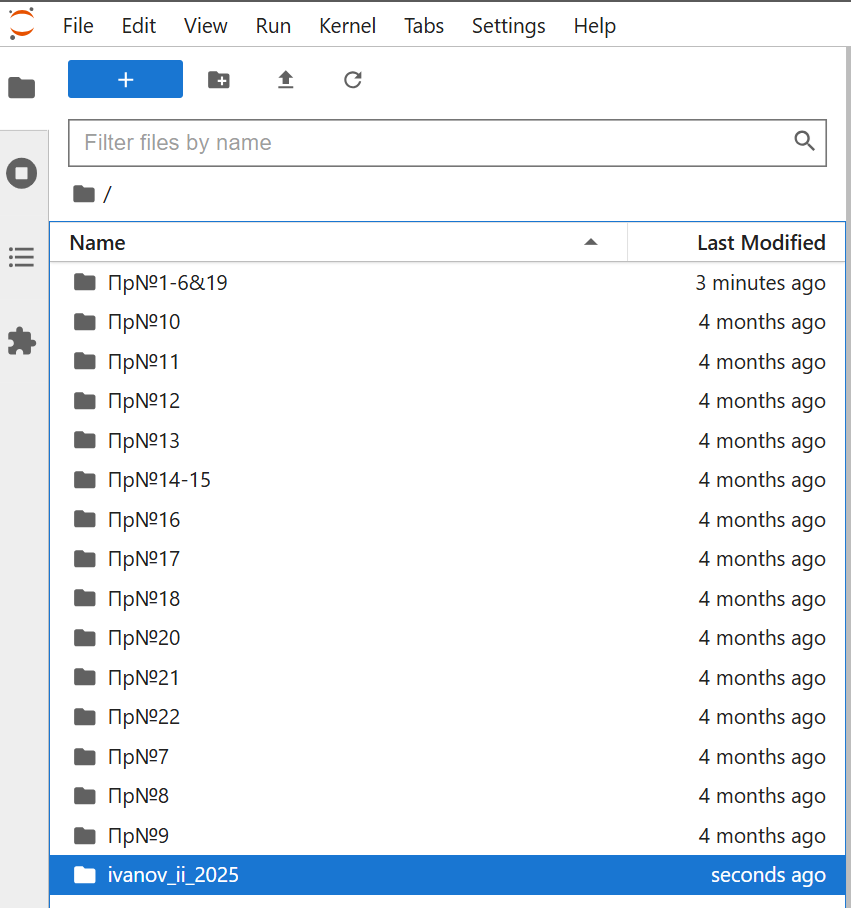

# Практическая работа №15 Машинное обучение. Content-based filtering

---

## 🎯 Цель работы.

Получить теоретические знания и практические навыки постановки и решения задачи формирования рекомендаций методом фильтрации пользователей по истории контента

## 📚 Основные идеи и теоретические основы.

Content-based filtering (фильтрация на основе контента) — это метод реализации рекомендательных систем, который рекомендует пользователю контент, похожий на тот, который ему понравился ранее, анализируя характеристики самих элементов (товаров, фильмов, статей и т. д.). Система создает цифровой профиль пользователя на основе его предпочтений и атрибутов просмотренного контента, а затем подбирает новые элементы с аналогичными характеристиками, например, тот же жанр фильма или музыку того же исполнителя. 

Как это работает
  - Анализ контента: Система анализирует характеристики объектов, такие как жанр фильма, исполнитель музыки, ключевые слова в статье или параметры товара.
  - Создание профиля пользователя: На основе взаимодействия пользователя с контентом (просмотры, покупки, лайки) создается его профиль.
  - Сопоставление: Алгоритм находит объекты в каталоге, которые имеют характеристики, наиболее близкие к тем, что указаны в профиле пользователя.
  - Персонализированные рекомендации: Пользователю предлагаются элементы, которые он, скорее всего, оценит, так как они похожи на то, что ему понравилось раньше.

Этот метод пытается определить, какие аспекты продукта нравятся пользователю больше всего, а затем рекомендует товары, отражающие эти аспекты. В нашем случае мы попытаемся определить любимые жанры пользователя на основе фильмов и рейтингов.

---

## 📁 Материалы и методы

- Операционная система - [Ubuntu 22.04](https://help.ubuntu.ru/wiki/командная_строка)
- Язык программирования – [python](https://www.python.org/).
- Основные технологии:
  -  [jupyter Notebook](https://jupyter.org/).
- Основные библиотеки:
  - [matplotlib](https://matplotlib.org/)
  - [numpy](https://numpy.org/)
  - [pandas](https://pandas.pydata.org/)
- Датасеты:
  - специальный датасет ["The Movies Dataset"](https://www.kaggle.com/datasets/rounakbanik/the-movies-dataset)

---

## 🧪 Программа работы 

---

### ⚙️ Настройка среды  

**Авторизоваться на сервере [Jupyter-Hub](https://jupyter.org/hub) по адресу [Jupyter-Hub-ИИСТ-НПИ](http://195.133.13.56:8000/)**


**С помощью файлового навигатора, расположенного слева перейти в свой каталог (ФИО и год), созданный ранее (двойным нажатием мыши)**



**Создать новую вкладку символом +**


**Выбрать тип новой вкладки -- Notebook**


**Сохранить / переименовать файл**


**Работать в новой вкладке вида**


**Импорт необходимых библиотек**

```python
import pandas as pd
from math import sqrt
import numpy as np
import matplotlib.pyplot as plt
%matplotlib inline
```

---

### 🧪 Применение Content-based filtering для Рекомендации Фильмов

1. 🧪 **Чтение данных с помощью pandas dataframe**
    ```python
    movies_df = pd.read_csv('/home/jupyter/work/data/movies.csv')
    ratings_df = pd.read_csv('/home/jupyter/work/data/ratings.csv')
    ```

2. 🧪 **Предварительная обработка и отбор данных**
  - Обзор данных о фильмах:
    ```python
    movies_df.head()
    ```
    Удалим год из столбца заголовка, используя функцию замены Pandas, и сохраним его в новом столбце года
    
    ```python
    movies_df['year'] = movies_df.title.str.extract('(\(\d\d\d\d\))',expand=False)
    movies_df['year'] = movies_df.year.str.extract('(\d\d\d\d)',expand=False)
    movies_df['title'] = movies_df.title.str.replace('(\(\d\d\d\d\))', '', regex = True)
    movies_df['title'] = movies_df['title'].apply(lambda x: x.strip())
    movies_df.head()
    ```
  - Давайте также разделим значения в столбце «Жанры» на список жанров для упрощения дальнейшего использования. Это можно сделать, применив функцию Python «Разделить строку» к нужному столбцу.
    ```python
    movies_df['genres'] = movies_df.genres.str.split('|')
    ```
  - Окончательный фрейм данных о фильмах:
    ```python
    movies_df.head()
    ```
  - Поскольку хранение жанров в виде списка не является оптимальным для системы рекомендаций на основе контента, мы воспользуемся методом кодирования One Hot Encoding для преобразования списка жанров в вектор, где каждый столбец соответствует одному возможному значению признака. Такое кодирование необходимо для передачи категориальных данных. В данном случае мы храним каждый жанр в столбцах, содержащих либо 1, либо 0. 1 означает, что фильм относится к этому жанру, а 0 — что нет. Также сохраним этот фрейм данных в другой переменной, поскольку жанры не будут важны для нашей первой системы рекомендаций.
    ```python
    moviesWithGenres_df = movies_df.copy()
    for index, row in movies_df.iterrows():
        for genre in row['genres']:
            moviesWithGenres_df.at[index, genre] = 1
    moviesWithGenres_df = moviesWithGenres_df.fillna(0)
    moviesWithGenres_df.head()
    ```

  - Обзор данных о рейтингах:
    ```python
    ratings_df.head()
    ```
    Каждая строка в таблице рейтингов содержит идентификатор пользователя, связанный как минимум с одним фильмом, рейтинг и временную метку, показывающую, когда пользователь оставил отзыв. Столбец с временной меткой нам не понадобится, поэтому давайте опустим его для экономии памяти.
    ```python
    ratings_df = ratings_df.drop(['timestamp'], axis=1)
    ```
  - Посмотрим на результат:
    ```python
    ratings_df.head()
    ```

3. 🧪 **Разработка модели**

```python
userInput = [
            {'title':'Breakfast Club, The', 'rating':5},
            {'title':'Toy Story', 'rating':3.5},
            {'title':'Jumanji', 'rating':2},
            {'title':"Pulp Fiction", 'rating':5},
            {'title':'Akira', 'rating':4.5}
         ] 
inputMovies = pd.DataFrame(userInput)
inputMovies
```

  - Извлечем идентификаторы входных фильмов из фрейма данных фильмов и добавим их в него. Этого можно добиться, сначала отфильтровав строки, содержащие названия фильмов, а затем объединив это подмножество с входным фреймом данных. Также мы удаляем ненужные столбцы для экономии памяти.
    ```python
    inputId = movies_df[movies_df['title'].isin(inputMovies['title'].tolist())]
    inputMovies = pd.merge(inputId, inputMovies)
    inputMovies = inputMovies.drop(['genres'], axis = 1).drop(['year'], axis = 1)
    inputMovies
    ```
  - Начнем с изучения предпочтений входных данных, поэтому давайте получим подмножество фильмов, которые были просмотрены входными данными, из Dataframe, содержащего жанры, определенные с помощью двоичных значений
    ```python
    userMovies = moviesWithGenres_df[moviesWithGenres_df['movieId'].isin(inputMovies['movieId'].tolist())]
    userMovies
    ```
  - Нам понадобится только сама таблица жанров, поэтому давайте немного ее подчистим, сбросив индекс и удалив столбцы movieId, title, genres и year
    ```python
    userMovies = userMovies.reset_index(drop=True)
    userGenreTable = userMovies.drop(['movieId'], axis = 1).drop(['title'], axis = 1).drop(['genres'], axis = 1).drop(['year'], axis = 1)
    userGenreTable
    ```
  - Преобразуем каждый жанр в весовые коэффициенты. Для этого мы используем отзывы на входе, умножаем их на таблицу жанров на входе и суммируем полученные значения по столбцам. Эта операция фактически представляет собой скалярное произведение матрицы и вектора, поэтому мы можем просто вызвать функцию dot библиотеки Pandas
    ```python
    inputMovies['rating']
    ```
    
    ```python
    userProfile = userGenreTable.transpose().dot(inputMovies['rating'])
    userProfile
    ```
  - Теперь у нас есть весовые коэффициенты для каждого предпочтения пользователя. Это называется профилем пользователя. Используя его, мы можем рекомендовать фильмы, которые соответствуют его предпочтениям. Начнем с извлечения таблицы жанров из исходного фрейма данных:
    ```python
    genreTable = moviesWithGenres_df.set_index(moviesWithGenres_df['movieId'])
    genreTable = genreTable.drop(['movieId'], axis=1).drop(['title'], axis=1).drop(['genres'], axis=1).drop(['year'], axis=1)
    genreTable.head()
    ```
    
    ```python
    genreTable.shape
    ```
  - Имея на руках профиль ввода и полный список фильмов и их жанров, мы собираемся вычислить средневзвешенное значение для каждого фильма на основе профиля ввода и рекомендовать двадцать фильмов, которые больше всего ему соответствуют.
    ```python
    recommendationTable_df = ((genreTable*userProfile).sum(axis=1))/(userProfile.sum())
    recommendationTable_df.head()
    ```

    ```python
    recommendationTable_df = recommendationTable_df.sort_values(ascending=False)
    recommendationTable_df.head()
    ```
  

4. 🧪 **А вот и таблица рекомендаций!**

```python
movies_df.loc[movies_df['movieId'].isin(recommendationTable_df.head(20).keys())]
```


--- 

### 📌 Задания

  - Добавить больше фильмов, увеличив количество элементов в поле userInput. Обязательно пишите заглавными буквами, а если фильм начинается с артикля «The», например, «Матрица», то напишите так: «Matrix, The».
  - Оцените время решения задачи при различном количестве фильмов, постройте график
  - Сформулируйте не менее 3 преимуществ и не менее 3 недостатков, которыми, по Вашему мнению обладает алгоритм фильтрации по содержанию

### 📌 Подготовить отчет о выполненном Задании
