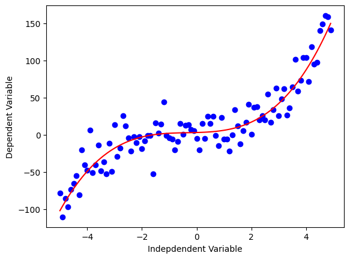
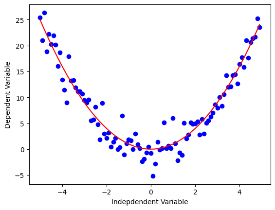
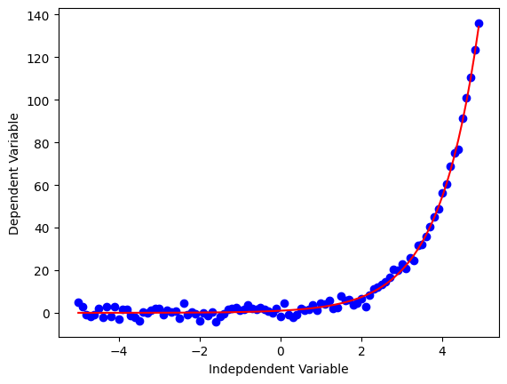
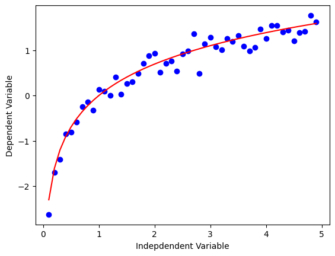
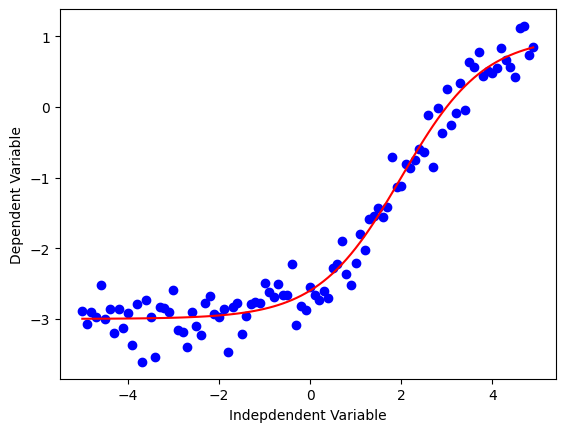

# Практическая работа №19: Машинное обучение. Non Linear Regression Analysis

---

## 🎯 Цель работы.

Получить теоретические знания и практические навыки постановки и решения задачи регрессии методом Non Linear Regression

---

## ⚠️ Важно

Это работа в формате **Notebook-based**. Вам будет доступен **ИИ-ментор** (`%%ask_mentor`). Модель, кроме ответа, дает оценку качества вопроса.

## 📚 Основные идеи и теоретические основы.

Хотя линейная регрессия очень хороша для решения многих задач, её можно использовать не для всех наборов данных. Она моделирует линейную связь между зависимой переменной y и независимой переменной x. Уравнение имеет простую форму, например, y = 2 𝑥 + 3.

Если изменение данных не похожи на линию, то линейная регрессия не даст достаточно точных результатов по сравнению с нелинейной регрессией, потому что, как следует из названия, линейная регрессия предполагает, что данные линейны.

Нелинейные регрессии – это взаимосвязь между независимыми переменными. 𝑥 и зависимая переменная 𝑦, что приводит к нелинейной функции, моделирующей данные. По сути, любая зависимость, не являющаяся линейной, может быть названа нелинейной и обычно представлена ​​полиномом 𝑘 степени.

$$ \ y = a x^3 + b x^2 + c x + d \ $$
 

Нелинейные функции могут содержать такие элементы, как экспоненты, логарифмы, дроби и другие. Например: 

$$ y = \log(x)$$
 

Или даже более сложно, например:

$$ y = \log(a x^3 + b x^2 + c x + d)$$


В данной практической работе мы используем нелинейную регрессию на примере. В частности, мы обучаем нелинейную модель на точках данных, соответствующим ВВП Китая с 1960 по 2014 год.

---

## 📁 Материалы и методы

- Операционная система - [Ubuntu 22.04](https://help.ubuntu.ru/wiki/командная_строка)
- Язык программирования – [python](https://www.python.org/).
- Основные технологии:
  -  [jupyter Notebook](https://jupyter.org/).
- Основные библиотеки:
  - [matplotlib](https://matplotlib.org/)
  - [numpy](https://numpy.org/)
  - [pandas](https://pandas.pydata.org/)
  - [scipy](https://scipy.org/)
- Датасеты:
  - специальный датасет ["china gdp dataset"](https://www.kaggle.com/datasets/iansurii/china-gdp-dataset)

**Варианты нелинейных функций**

Ниже представлены программы для отображения графиков различных функций, сплошными линиями на них отображаются оригиналы, а точками - примеры результатов измерений таких функций (например, с помощью различных приборов, обладающих погрешностями)

  - График кубической функции
  ```python
  x = np.arange(-5.0, 5.0, 0.1)
  y = 1*(x**3) + 1*(x**2) + 1*x + 3
  y_noise = 20 * np.random.normal(size=x.size)
  ydata = y + y_noise
  plt.plot(x, ydata,  'bo')
  plt.plot(x,y, 'r') 
  plt.ylabel('Dependent Variable')
  plt.xlabel('Indepdendent Variable')
  plt.show()
  ```

  - График квадратичной функции
  ```python
  x = np.arange(-5.0, 5.0, 0.1)
  y = np.power(x,2)
  y_noise = 2 * np.random.normal(size=x.size)
  ydata = y + y_noise
  plt.plot(x, ydata,  'bo')
  plt.plot(x,y, 'r') 
  plt.ylabel('Dependent Variable')
  plt.xlabel('Indepdendent Variable')
  plt.show()
  ```

  - График экспоненциальной функции
  ```python
  x = np.arange(-5.0, 5.0, 0.1)
  y = np.exp(x)
  y_noise = 2 * np.random.normal(size=x.size)
  ydata = y + y_noise
  plt.plot(x, ydata,  'bo')
  plt.plot(x,y, 'r') 
  plt.ylabel('Dependent Variable')
  plt.xlabel('Indepdendent Variable')
  plt.show()
  ```

  - График логарифмической функции
  ```python
  x = np.arange(-5.0, 5.0, 0.1)
  y = np.log(x)
  y_noise = 0.2 * np.random.normal(size=x.size)
  ydata = y + y_noise
  plt.plot(x, ydata,  'bo')
  plt.plot(x,y, 'r') 
  plt.ylabel('Dependent Variable')
  plt.xlabel('Indepdendent Variable')
  plt.show()
  ```

  - График сигмоидальной/логистической функции
  ```python
  x = np.arange(-5.0, 5.0, 0.1)
  y = 1-4/(1+np.power(3, x-2))
  y_noise = 0.2 * np.random.normal(size=x.size)
  ydata = y + y_noise
  plt.plot(x, ydata,  'bo')
  plt.plot(x,y, 'r') 
  plt.ylabel('Dependent Variable')
  plt.xlabel('Indepdendent Variable')
  plt.show()
  ```


---

## 🧪 Программа работы 

---

### ⚙️ Настройка среды  

**Откройте JupyterHub**: `http://<server-ip>:8000`, войдите под своей учётной записью.

В левой части Jupyter Lab перейдите (предположим, Вы находитесь в своем корневом каталоге `~`) в `project` -> `reports`

Создайте новый каталог `Pr_19`

Создайте новый Jupyter Notebook: **File → New → Notebook → Python 3 (ipykernel)**.

Сохраните новый Jupyter Notebook под именем `Pr_19_report.ipynb` (в `~/project/reports/Pr_19`)

Введите первый блок кода в первую ячейку — проверка версии Python:

```python
import sys
print(f"Python version: {sys.version}")
```

**Далее приведены задания для самостоятельного выполнения**. 

В ходе выполнения рекомендуется комментировать код. Комментарии в Python начинаются с символа `#`, все, что следует за ним, не будет выполнено. 

При появлении ошибок и наличии вопросов рекомендуется использовать встроенного ИИ-ментора, например
```python
%%ask_mentor
Почему при выполнении freq = {word: len(words) for word, words in [("cat", 3), ("dog", 4)]} появляется ошибка
TypeError                                 Traceback (most recent call last)
Cell In[8], line 46
     44 squares_dict = {x: x ** 2 for x in range(1, 6)}
     45 # {1: 1, 2: 4, 3: 9, 4: 16, 5: 25}
---> 46 freq = {word: len(words) for word, words in [("cat", 3), ("dog", 4)]}

Cell In[8], line 46, in <dictcomp>(.0)
     44 squares_dict = {x: x ** 2 for x in range(1, 6)}
     45 # {1: 1, 2: 4, 3: 9, 4: 16, 5: 25}
---> 46 freq = {word: len(words) for word, words in [("cat", 3), ("dog", 4)]}

TypeError: object of type 'int' has no len()
```

---


**Импорт необходимых библиотек**

```python
import numpy as np
import pandas as pd
import matplotlib.pyplot as plt
%matplotlib inline
```

---

### 🧪 Применение нелинейной регрессии

1. 🧪 **Чтение данных**
    ```python
    df = pd.read_csv("~/data/china_gdp.csv")
    df.head(10)
    ```

2. 🧪 **Исследование данных**
  - Построение графика данных:
    ```python
    plt.figure(figsize=(8,5))
    x_data, y_data = (df["Year"].values, df["Value"].values)
    plt.plot(x_data, y_data, 'ro')
    plt.ylabel('GDP')
    plt.xlabel('Year')
    plt.show()
    ```
    Предполагаем, что логистическая функция может быть хорошим приближением, поскольку она имеет свойство начинаться с медленного роста, увеличиваться в середине и затем снова уменьшаться в конце, как показано ниже:
    
    ```python
    X = np.arange(-5.0, 5.0, 0.1)
    Y = 1.0 / (1.0 + np.exp(-X))
    
    plt.plot(X,Y) 
    plt.ylabel('Dependent Variable')
    plt.xlabel('Indepdendent Variable')
    plt.show()
    ```

3. 🧪 **Построение модели**

   -  Определим логистическую функцию в виде отдельной процедуры:
    ```python
    def sigmoid(x, Beta_1, Beta_2):
         y = 1 / (1 + np.exp(-Beta_1*(x-Beta_2)))
         return y
    ```
    - Построим пример сигмовидной линии, которая может соответствовать данным (параметры функции пока выберем произвольно)
    ```python
    beta_1 = 0.10
    beta_2 = 1990.0
    
    Y_pred = sigmoid(x_data, beta_1 , beta_2)
    
    plt.plot(x_data, Y_pred*15000000000000.)
    plt.plot(x_data, y_data, 'ro')
    ```
  - Задача — найти наилучшие параметры для нашей модели. 

4. 🧪 **Нормализуем наши x и y:**

```python
xdata =x_data/max(x_data)
ydata =y_data/max(y_data)
```
Далее используем функцию ```curve_fit```, которая использует нелинейный метод наименьших квадратов для подгонки нашей сигмоидальной функции к данным. Оптимальные значения параметров должны быть такими, чтобы сумма квадратов остатков sigmoid(xdata, *popt) - ydata была минимизирована.

popt — наши оптимизированные параметры.

5. 🧪 **Обучение модели - поиск лучших параметров. scipy**

```python
from scipy.optimize import curve_fit
popt, pcov = curve_fit(sigmoid, xdata, ydata)
#print the final parameters
print(" beta_1 = %f, beta_2 = %f" % (popt[0], popt[1]))
```

6. 🧪 **Визуализация**

```python
x = np.linspace(1960, 2015, 55)
x = x/max(x)
plt.figure(figsize=(8,5))
y = sigmoid(x, *popt)
plt.plot(xdata, ydata, 'ro', label='data')
plt.plot(x,y, linewidth=3.0, label='fit')
plt.legend(loc='best')
plt.ylabel('GDP')
plt.xlabel('Year')
plt.show()
```

--- 

### 📌 Задания

  - Решить задачу с использованием экспоненциальной функции
  - Оценить точности обеих моделей, выбрать лучшую, обосновать выбор

## 📌 Отчёт о выполненной работе после выполнения заданий / завершения занятия

1. Сохраните Jupyter Notebook `Pr_19_report.ipynb`
2. Загрузите файл в свой репозиторий в GitLab:
   - В левом окне Jupyter Lab (файловом менеджере) перейдите в каталог `project` (поднимитесь на два уровня вверх: из `Pr_19` в `reports` -> `project`)
   - Создайте новую вкладку типа `Terminal` (File -> New -> Terminal)
   - Введите

```bash
git add . && git commit -m "Pr_19 notebook report" && git push
```

> ⏳ Оценка запустится автоматически в GitLab CI. Результат появится в разделе **CI/CD → Pipelines**.
