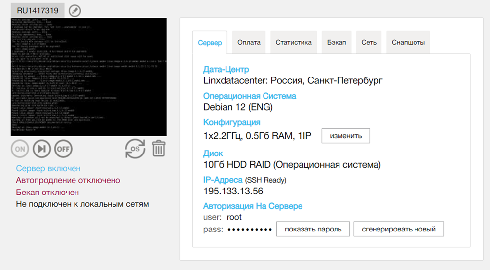
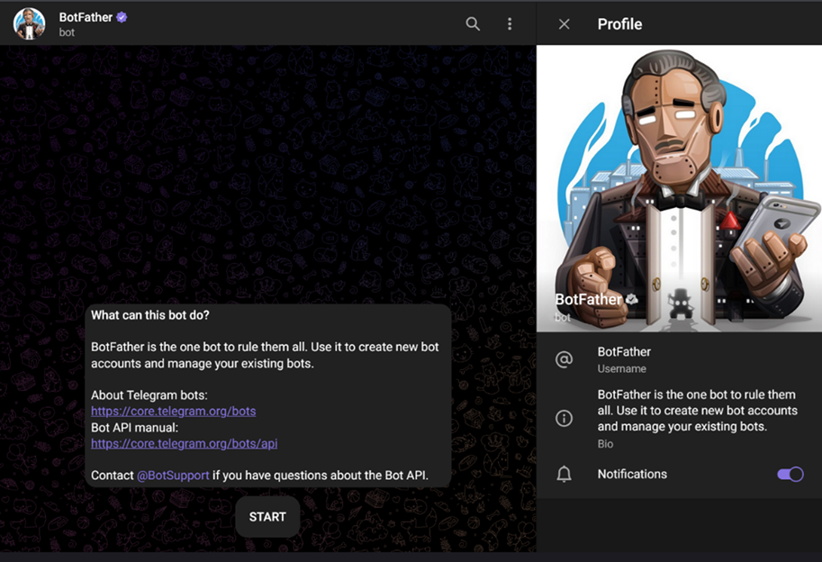
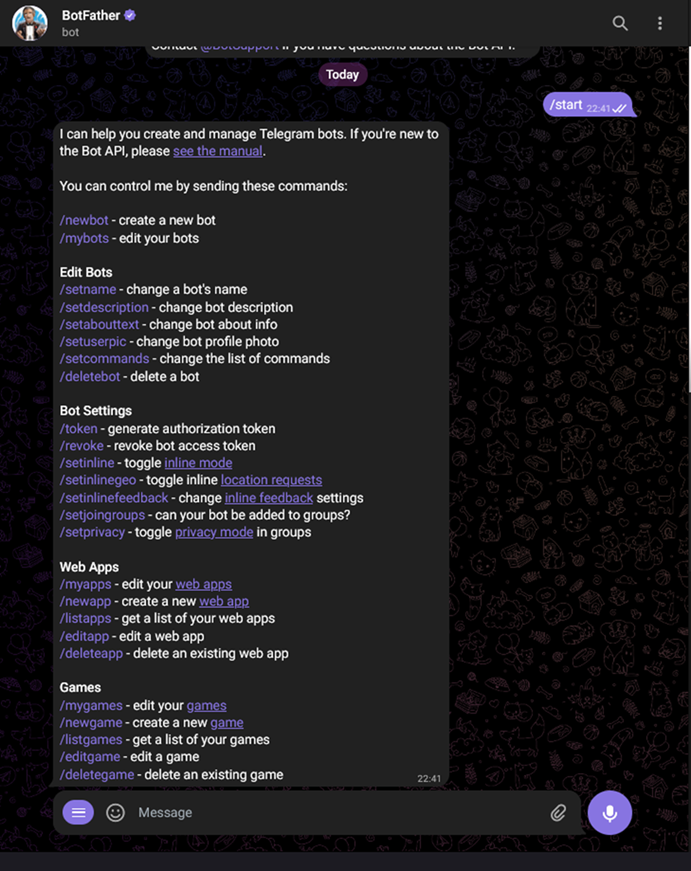
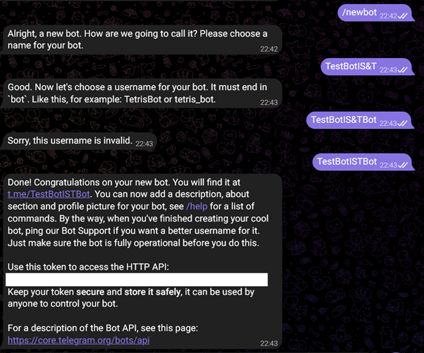

# Практическая работа №2 Основы работы с технологиями контейнеризации и ботами Telegram

---

## 🎯 Цель работы.

Создание сервера с постоянно работающим Telegram ботом

---

## 📁 Материалы и методы

- Операционная система - [Ubuntu 22.04](https://help.ubuntu.ru/wiki/командная_строка)
- Язык программирования – [bash](https://habr.com/ru/articles/47163/).
- Основные библиотеки:
  -  [git](https://habr.com/ru/articles/541258/).
  -  [Docker](https://www.docker.com/).
  -  [BotFather](https://telegram.me/BotFather)
 
---

## 🧪 Программа работы 

---

### ⚙️ Настройка среды  

**Авторизоваться на сервере [Jupyter-Hub](https://jupyter.org/hub) по адресу [Jupyter-Hub-ИИСТ-НПИ](http://89.110.116.79:7998/)**


**Создать новую вкладку символом +**


**Выбрать тип новой вкладки -- Terminal**


**Работать в новой вкладке вида**


**(При первом входе на сервер) Создать каталог с именем, соответствующим Вашим ФИО и году обучения, например:**

```bash
mkdir ivanov_ii_2026
```

**(При втором и последующих входах на сервер) Перейти каталог с именем, соответствующим Вашим ФИО и году обучения, например:**

```bash
cd ivanov_ii_2026
```

---


### 📌 Создание бота

  - Создаем и переходим в новый каталог с именем, соответствующим номеру практической работы:
  ```bash
  mkdir pr_2
  cd pr_2
  ```
  - Проверяем работу python3.10
  ```bash
  python3.10
  ```
  - Выходим
  ```python
  exit()
  ```
  - Для того, чтобы не нарушать структуру базового python, не мешать своими установками администраторам серверов и коллегам, создаем «окружение» *python3.10 env* и [активируем его](https://netpoint-dc.com/blog/python-venv-ubuntu-1804/)
  ```bash
  python3.10 -m venv env
  source env/bin/activate
  ```
  - В результате в начале командной строки появляется указание на использование окружения ```(env) student@uuser-X10X99-16D:~/pr_2$```
  - Устанавливаем необходимые pip-пакеты, в частности, нам понадобится
  ```bash
  pip install telepot==12.7
  ```
  - Создаем собственную учетную запись – нового бота, как это указано в [Приложении 2](Pr_2.md#-приложение-2-справочное-регистрация-собственного-бота-telegram) (дополнительно см. ["Step 2: Text /newbot to BotFather"](https://www.instructables.com/Set-up-Telegram-Bot-on-Raspberry-Pi/)). 
  - Получаем токен, его будет достаточно для работы простейшего приложения, которое на /command1 будет отвечать Oks, а на /command2 - Ok.
  - Запускаем текстовый редактор:
  ```bash
  nano bot.py
  ```
  - Код приложения:
  ```python
  import telepot
  import time
  
  def handle(msg):
      chat_id = msg['chat']['id']
      command = msg['text']
  
      print('Got command: %s' % command)
      print('From : %s' % chat_id)
  
      if command == '/command1':
          bot.sendMessage(chat_id, 'Oks')
      elif command == '/command2':
          bot.sendMessage(chat_id, 'Ok')
  
  bot = telepot.Bot('***** PUT YOUR TOKEN HERE *****')
  bot.message_loop(handle)
  print('I am listening ...')
  
  while 1:
      time.sleep(10)
  ```
В данном коде следует изменить строку ```bot = telepot.Bot('***** PUT YOUR TOKEN HERE *****')```, вставив свой токен.
  - Cохраняем файл ```Ctrl+O```, выходим ```Ctrl+X```.
  - Запускаем программу:
  ```bash
  python bot.py
  ```
  - 📌 Проверяем работу бота, находя его через telegram.
  - 📌 Настраиваем работу собственной python-программы в виде docker-контейнера с автозапуском после старта ОС (см. по [ссылке](https://habr.com/ru/companies/vdsina/articles/555540/) и по [ссылке](https://habr.com/ru/companies/ruvds/articles/439980/))
    - Отключаем python env, так как теперь в качестве закрытого окружения будет docker-контейнер:
    ```bash
    deactivate
    ```
    - Создаем файл requirements.txt со списком pip-библиотек, необходимых для работы нашей программы
    ```bash
    nano requirements.txt
    ```
    - Вводим следующее содержимое:
    ```bash
    telepot==12.7
    ```
    - Cохраняем файл ```Ctrl+O```, выходим ```Ctrl+X```.
    - Создаем файл для сборки docker образа
    ```bash
    nano Dockerfile
    ```
    - Вводим следующее содержание
    ```bash
    FROM python:3.10 AS builder
    COPY requirements.txt .
    RUN pip install --user -r requirements.txt
    FROM python:3.10-slim
    WORKDIR /code
    COPY --from=builder /root/.local /root/.local
    COPY ./bot.py .
    ENV PATH=/root/.local:$PATH
    CMD [ "python", "-u", "./bot.py" ]
    ```
    - Cохраняем файл ```Ctrl+O```, выходим ```Ctrl+X```.
*ПРИМЕЧАНИЕ* Следует обратить внимание на версию python: указанная в данном примере соответствует python, установленном на сервере 10.8.0.5,
если Вы используете свой сервер, но следует указать версию, установленную на нем, например,
для Debian 12 по умолчанию устанавливается python:3.11
    - Собираем docker образ с именем – номером Вашей зачетки
    ```bash
    docker build -t номер_зачетки .
    ```
    - Запускаем *docker* образ в режиме работы в фоне (*-d*) и даем команду запуска при перезапуске *docker* (*--restart=always*)
    ```bash
    docker run -d --restart=always номер_зачетки
    ```
    - Проверяем, что в ответ на данную команду, docker сообщит CONTAINER ID вида
    ```bash
    5df687ebc2f6380abd23e4ac5f7899c5f9a8a0e414cfa633ffefb0c372e40fcd
    ```
    - Также данный CONTAINER ID можно понять из списка, выдаваемого в ответ на команду:
    ```bash
    docker ps -a
    ```
    - Пример ответа:
    ```bash
    CONTAINER ID   IMAGE          COMMAND                CREATED              STATUS              PORTS     NAMES
    5df687ebc2f6       000000           "python -u ./bot.py"     About a minute ago Up About a minute                bold_bhabha
    ```
    - В данном случае CONTAINER ID значительно короче; можно пользоваться любым номером. Например, для просмотра log'ов (в данном случае - результатов работы функций "print(" программы):
    ```bash
    docker logs 5df687ebc2f6
    ```
    - Пример ответа:
    ```bash
    Got command: /command1
    From : 384540254
    ```
    - После проверки следует сохранить docker image в виде архива. Это может быть полезно для передачи Вашим заказчикам, например, если нет желания и возможности воспользоваться Docker Hub
    - Cохраняем образ [командой](https://stackoverflow.com/questions/24482822/how-to-share-my-docker-image-without-using-the-docker-hub)
    ```bash
    docker save -o <path for created tar file> <image name>
    ```
    Например,
    ```bash
    docker save -o ./docker_image_000000.tar 000000
    ```
    - Находим файл образа в правой части рабочего окна, нажимаем на него правой кнопкой, выбираем **Download**, сохраняем локально.
  - 📌 Закрываем текущий Terminal 
--- 

## 🧪 Приложение №1 (Справочное) Подготовка собственного облачного сервера для выполнения программ в docker

- Покупаем себе сервер VPS, например, вот [тут](https://ruvds.com/ru-rub/my/orders), выбирая в качестве ОС, например, Debian 12.
- Ждем, пока завершится установка, видим в [списке](https://ruvds.com/ru-rub/my/servers) новый сервер, его IP, просматриваем и копируем пароль.



- На рисунке показан существующий сервер 195.133.13.56 и его можно использовать. Из Windows PowerShell подключаемся к нему удаленно под пользователем root.
  ```bash
  ssh root@195.133.13.56
  ```
- Стандартные команды проверки последних обновлений для Ubuntu/Debian после установки:
  ```bash
  apt-get update
  apt-get upgrade
  apt install htop nano
  ```
- Создаем нового пользователя student с собственным каталогом и задаем ему пароль.
  ```bash
  useradd -m student -s /bin/bash
  passwd student
  ```
- Добавляем его в группу, которая может подключаться по ssh к серверу (см. [ссылку](https://ostechnix.com/allow-deny-ssh-access-particular-user-group-linux/)).
  ```bash
  nano /etc/ssh/sshd_config
  ```
  в конце файла добавляем
  ```bash
  AllowUsers student root
  ```
  Cохраняем файл ```Ctrl+O```, выходим ```Ctrl+X```.
  Перезапускаем службу ssh
  ```bash
  systemctl restart sshd
  ```
  Пробуем из второго окна Windows PowerShell подключиться с указанными учетными данными
  ```bash
  ssh student@195.133.13.56
  ```
  Иногда проявляется ошибка в подключении к серверу по ssh (долгое ожидание сообщение о невозможности подключения). В таком случае следует [воспользоваться](https://serverfault.com/a/918810) или [вот этим](https://www.seei.biz/ssh-fails-to-connect-with-debug1-expecting-ssh2_msg_kex_ecdh_reply/)
- В первом окне Windows PowerShell из-под учетной записи root устанавливаем [docker engine](https://docs.docker.com/engine/install/debian/)
  ```bash
  apt-get install ca-certificates curl
  install -m 0755 -d /etc/apt/keyrings
  curl -fsSL https://download.docker.com/linux/debian/gpg -o /etc/apt/keyrings/docker.asc
  chmod a+r /etc/apt/keyrings/docker.asc
  echo \
    "deb [arch=$(dpkg --print-architecture) signed-by=/etc/apt/keyrings/docker.asc] https://download.docker.com/linux/debian \
    $(. /etc/os-release && echo "$VERSION_CODENAME") stable" | \
    sudo tee /etc/apt/sources.list.d/docker.list > /dev/null
  apt-get update
  apt-get install docker-ce docker-ce-cli containerd.io docker-buildx-plugin docker-compose-plugin
  ```
  Проверяем работу под root (после указанной команды ошибок быть не должно)
  ```bash
  docker run hello-world
  ```
  Добавляем группу docker
  ```bash
  groupadd docker
  ```
  Добавляем в эту группу student'а
  ```bash
  usermod -aG docker student
  ```
  В окне с учетной записью student сначала переобновляем свои данные в группе
  ```bash
  newgrp docker
  ```
  потом проверяем работу (после указанной команды ошибок быть не должно)
  ```bash
  docker run hello-world
  ```
- Устанавливаем *python* из учетной записи *root*.
  ```bash
  apt install python3 python3-pip python3-venv
  ```
  Затем снимаем запрет student’у устанавливать пакеты через pip
  ```bash
  rm /usr/lib/python3.11/EXTERNALLY-MANAGED
  ```
- Добавьте последний файл в новую ветку.
- Зафиксируйте изменения.
- Объедините изменения в новой ветке с основной.

## 🧪 Приложение №2 (Справочное) Регистрация собственного бота Telegram

Откройте Telegram на своем телефоне, найдите пользователя по имени BotFather (поиск формирует несколько аналогов, нужен именно @BotFather). 
Как следует из названия, он является «отцом» всех ботов. 



Он принимает специальные команды.



Чтобы получить учетную запись бота, отправьте ему сообщение /newbot. 
Он задаст пару вопросов. 
В конце процесса вам будет предоставлен токен, имеющий вид аналогичный 123456789:ABCdefGhIJKlmNoPQRsTUVwxyZ. 
Этот токен вам потребуется для работы программы на python. Скопируйте его в текстовый файл. 



## 🧪 Приложение №3 (Справочное) Дополнительные команды при работе в Docker

  - Остановка контейнера
  ```bash
  docker stop 50046704457e9745897ba2c36e99e9c115ef89f3c41fa443beca5a7668668342
  ```
  - Удаление котейнера
  ```bash
  docker rm 50046704457e9745897ba2c36e99e9c115ef89f3c41fa443beca5a7668668342
  ```
  - Удаление образа image
  ```bash
  docker image rm 000000
  ```
---

## 📌 Подготовить отчет о выполненной работе
