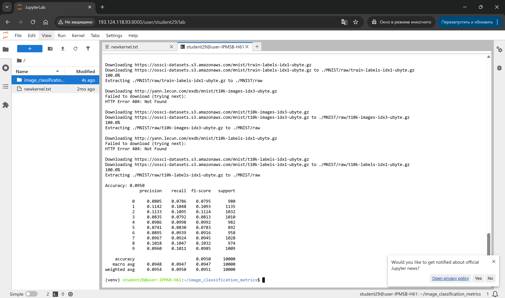
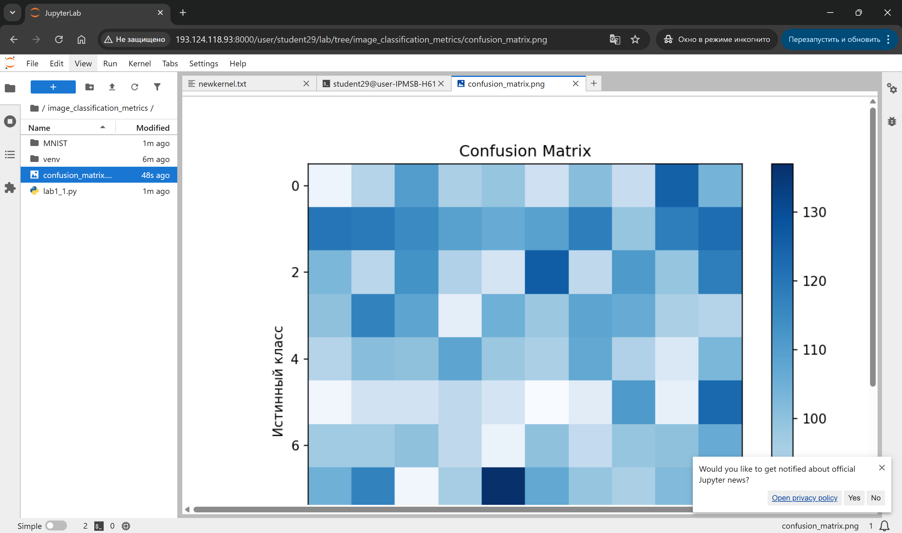

# Практическая работа №22: Метрики оценки качества классификации изображений.

> 📖 Перед началом работы ознакомьтесь со [справочником по Markdown](./MD_Instructions.md) — он пригодится для оформления отчётов.

---

## 🎯 Цель работы  
Изучить ключевые метрики качества классификации изображений:  
- Confusion Matrix  
- Accuracy  
- Recall  
- Precision  
- F1-Score  

---

## 📌 Задачи  
- Изучить устройство и смысл Confusion Matrix  
- Понять метрику Accuracy  
- Изучить Recall  
- Изучить Precision  
- Рассчитать и интерпретировать F1-Score  

---

## 📁 Материалы и методы
- Язык программирования – Python 3.10.
- Основные библиотеки:
  -  [scikit-learn](https://scikit-learn.org/),
  -  [matplotlib](https://matplotlib.org/),
  -  [PyTorch (torch, torchvision)](https://pytorch.org/).
  
### 📁 Сведения о датасетах  
- [**MNIST**](https://www.kaggle.com/datasets/hojjatk/mnist-dataset): 60 000 изображений цифр (28×28), 10 классов  
- [**Fashion-MNIST**](https://www.kaggle.com/datasets/zalando-research/fashionmnist): 70 000 изображений одежды (28×28, градации серого), 10 классов (футболки, брюки, обувь и т. д.), аналог по формату оригинального MNIST, но более сложные объекты 
- [**CIFAR-10**](https://www.kaggle.com/c/cifar-10/): 60 000 цветных изображений (32×32), 10 классов (самолёты, автомобили, птицы и т. д.), 50 000 примеров для обучения, 10 000 для теста

---

## 📚 Краткая теоретическая информация  

### Confusion Matrix  
|               | Предсказано: Положительное | Предсказано: Отрицательное |
|---------------|----------------------------|-----------------------------|
| Истинное: Положительное (TP) | TP | FN |
| Истинное: Отрицательное (TN) | FP | TN |

### Метрики  
- **Accuracy**:  
  

$$
  Accuracy = \frac{TP + TN}{TP + FP + FN + TN}
$$


- **Recall**:  
  

$$
  Recall = \frac{TP}{TP + FN}
$$


- **Precision**:  
  

$$
  Precision = \frac{TP}{TP + FP}
$$


- **F1-Score**:  
  

$$
  F1 = 2 \cdot \frac{Precision \cdot Recall}{Precision + Recall}
$$


- **ROC-кривая и AUC**

ROC-кривая (Receiver Operating Characteristic) отображает зависимость истинно-положительной доли (TPR) от ложно-положительной доли (FPR) при изменении порога решения.

TPR (чувствительность, Recall) рассчитывается как


$$
  TPR = \frac{TP}{TP + FN}
$$


FPR определяется как


$$
  FPR = \frac{FP}{FP + TN}
$$


AUC (Area Under Curve) — площадь под ROC-кривой. Значение AUC в интервале от 0.5 (случайная модель) до 1.0 (идеальная модель) отражает общее качество разделения классов независимо от порога.

- **Balanced Accuracy и Cohen’s Kappa**

Balanced Accuracy — среднее значение полноты по классам. Для бинарной классификации:


$$
  BalancedAccuracy = \frac{1}{2} \cdot ( \frac{TP}{TP + FN} + \frac{TN}{TN + FP} )
$$


Cohen’s Kappa измеряет согласие предсказаний и истинных меток с поправкой на случайное совпадение:


$$
  k = \frac{p_{0} - p_{e}}{1 - p_{e}},
$$


где p<sub>0</sub> -- наблюдаемая точность (Accuracy), а p<sub>e</sub> -- ожидаемая точность при случайном угадывании.

---

## 🌳 Основные алгоритмы
1. [**SVM (Support Vector Machine)**](https://scikit-learn.org/stable/modules/svm.html):
- Максимизирует отступ между классами
- Поддерживает ядра (линейное, RBF и др.)
2. [**RandomForest**](https://scikit-learn.org/stable/modules/generated/sklearn.ensemble.RandomForestClassifier.html):
- Ансамбль из множества деревьев решений
- Усредняет предсказания для устойчивости к переобучению
3. [**Простейшая CNN (Convolutional Neural Network)**](https://www.datacamp.com/tutorial/pytorch-cnn-tutorial):
- Слой свёртки + ReLU + пулинг
- Несколько таких блоков + полносвязный слой
- В PyTorch: *torch.nn.Conv2d*, *torch.nn.MaxPool2d*, *torch.nn.Linear* 

### ⚙️ Настройка среды

**Авторизоваться на сервере [JupyterHub](https://jupyter.org/hub) по адресу `http://<server-ip>:8000/`**

> ⚠️ Замените `<server-ip>` на IP-адрес вашего сервера (указан преподавателем).

1. Откройте браузер и перейдите по адресу `http://<server-ip>:8000/`
2. Войдите под своей учётной записью (должна была быть создана в рамках [ознакомительного занятия](./Pr_0.md), типовое имя `student_<группа>_<номер>`)


***📁 Форк проекта и Клонирование и работа через командную строку***

... были выполнены в рамках [ознакомительного занятия](./Pr_0.md)

**Перейти в рабочий каталог**

В файловом навигаторе (левая часть поля JupyterLab) необходимо
- зайти в каталог `project` -> `reports` (двойной клик мыши на названии каталога)
- создать новый каталог `Pr_22`,
- создать в `Pr_22` MarkDown-файл, сохранить его в `project/reports/Pr_22` под именем `Pr_22_report.md`; данный файл будет использован для формирования отчета;
  - для создания нужно в правой части окна JupyterLab создать новую вкладку **Launcher** и выбрать тип файла `MarkDown File`
  - для сохранения нужно нажать на клавиатуре `Ctrl+S` и ввести имя файла `Pr_22_report.md`
- аналогично создать в `Pr_22` файл `LLM_Help.ipynb` (для уточняющих вопросов)
- в левом меню вернуться в `project`, открыть в нем **Terminal**
  - переход на уровень выше осуществляется одинарным щелчком по имени каталога, размещенном над файловым менеджером в левой части JupyterLab
  - для открытия вкладки типа **Terminal** нужно нажать символ **+** в правой части JupyterLab и выбрать **Terminal**
### Ввести последовательно (каждую строку отдельно):

```bash
mkdir image_classification_metrics
cd image_classification_metrics
pip list | grep -iE 'numpy|matplotlib|scikit-learn|torch|torchvision|torchaudio|seaborn|umap-learn'
```

---
## 🧪 Примеры

### 🧪 Простейший пример со случайными метками на изображениях

Нижеприведенный скрипт имитирует работу классификатора, который «ничего не знает» о задаче: он загружает тестовую часть MNIST, для каждого изображения случайным образом подбирает цифру от 0 до 9, затем считает базовые метрики (Accuracy, Precision/Recall/F1 по классам) и строит матрицу ошибок. Результат служит базовой точкой сравнения: случайно угадывающая модель должна давать Accuracy ≈ 1/10 (≈ 10 %), а диагональ её матрицы ошибок не выделяется на фоне остальных клеток.

Создать файл из командной строки с использованием текстового редактора *nano*

```bash
nano pr22_1.py
```

В `pr22_1.py` нужно вставить текст:

```python
#!/usr/bin/env python3
import os
import torch
from torchvision import datasets, transforms
from torch.utils.data import DataLoader
from sklearn.metrics import confusion_matrix, classification_report, accuracy_score
import matplotlib.pyplot as plt
import numpy as np

# 1. Загрузка MNIST
transform = transforms.Compose([transforms.ToTensor()])
data_root = os.path.expanduser('~/data')
train_ds = datasets.MNIST(data_root, download=False, train=False, transform=transform)
loader = DataLoader(train_ds, batch_size=256, shuffle=False)

# 2. Простая модель: случайные метки
y_true, y_pred = [], []
for images, labels in loader:
    y_true.extend(labels.numpy())
    # Имитируем предсказания случайным образом
    y_pred.extend(np.random.randint(0, 10, size=labels.shape))

y_true = np.array(y_true)
y_pred = np.array(y_pred)

# 3. Расчёт метрик
acc = accuracy_score(y_true, y_pred)
report = classification_report(y_true, y_pred, digits=4)
cm = confusion_matrix(y_true, y_pred)

print(f"Accuracy: {acc:.4f}")
print(report)

# 4. Визуализация матрицы ошибок
plt.figure(figsize=(8, 6))
plt.imshow(cm, interpolation='nearest', cmap='Blues')
plt.title("Confusion Matrix")
plt.colorbar()
plt.xlabel("Предсказанный класс")
plt.ylabel("Истинный класс")
plt.savefig("confusion_matrix.png", dpi=150)
```

**📖 Что происходит в коде:**
- `transforms.Compose([transforms.ToTensor()])` — переводит изображения (PIL) в тензоры PyTorch и масштазирует яркость пикселей с диапазона 0–255 в 0.0–1.0;
- `datasets.MNIST(..., train=False, ...)` — загрузка тестовой части MNIST (10 000 изображений): модель не обучается, нужны только изображения и истинные метки;
- `DataLoader(train_ds, batch_size=256, shuffle=False)` — разбивает датасет на пакеты по 256 изображений, чтобы удобно пройти по всем данным циклом;
- `np.random.randint(0, 10, size=labels.shape)` — для каждого изображения случайно подбирается цифра 0–9: имитация предсказаний «случайного классификатора»;
- `accuracy_score(y_true, y_pred)` — доля верно распознанных изображений;
- `classification_report(y_true, y_pred, digits=4)` — таблица по каждому классу: precision, recall, F1-score и support (сколько примеров этого класса в данных);
- `confusion_matrix(y_true, y_pred)` — матрица 10×10: строки — истинные классы, столбцы — предсказанные; элемент (i, j) показывает, сколько изображений цифры i модель назвала цифрой j;
- `plt.imshow(cm, cmap='Blues')` — отрисовывает матрицу как тепловую карту: чем темнее клетка, тем больше ошибок такого типа.

**Ожидаемый результат:** Accuracy ≈ 0.09–0.11 (уровень случайного угадывания, ≈ 1/10); все клетки матрицы примерно одинаковой интенсивности, диагональ не выделяется. Эти значения — нижняя граница, с которой будут сравниваться реальные модели.

Сохранить текст `Ctrl+O` - `Enter` и выйти из редактора *nano* `Ctrl+X`

Показать текст программы

```bash
cat pr22_1.py
```

Запуск из командной строки:

```bash

python3 pr22_1.py

```

Убедиться в создании файлов с изображением Confusion Matrix. Это можно сделать, используя правую часть окна:
- Двойным нажатие на имени каталога переходим в каталог `image_classification_metrics`



- Открываем файл `confusion_matrix.png` двойным нажатием




### 📌 Задание для самостоятельной работы #1
1. Заменить генерацию случайных меток на простую модель, например, логистическую регрессию из sklearn.linear_model.LogisticRegression на признаках, полученных из изображений (развёрнутый в вектор 784-х).
2. Пересчитать и визуализировать метрики для полученной модели.

```python
# Заготовка для самостоятельного задания
from sklearn.linear_model import LogisticRegression

# ... загрузка данных и разворачивание изображений ...
model = LogisticRegression(max_iter=200)
model.fit(X_train, y_train)
y_pred = model.predict(X_test)

# рассчитать и вывести метрики
```

**💡 Как подойти к заданию:**
1. Загрузите MNIST дважды: с `train=True` (60 000 изображений) и с `train=False` (10 000) — первое для обучения, второе для оценки.
2. Разверните каждое изображение в вектор из 784 признаков: `img.reshape(-1)` (28×28 = 784); соберите массивы `X_train`, `y_train`, `X_test`, `y_test`.
3. Обучите модель на обучающих данных: `model.fit(X_train, y_train)`.
4. Получите предсказания на тестовых данных: `y_pred = model.predict(X_test)`.
5. Рассчитайте метрики так же, как в примере 1 — `accuracy_score`, `confusion_matrix`, `classification_report`, — и визуализируйте матрицу ошибок.

> ⚠️ Метрики нужно рассчитывать на **тестовых** данных, а не на обучающих: на обучающих модель «уже видела ответы», и оценка будет завышена. Если появится предупреждение `ConvergenceWarning` — увеличьте `max_iter`.
>
> **Ожидаемый результат:** Accuracy существенно выше 10 % (для LogisticRegression на MNIST — около 90 % и выше), диагональ матрицы ошибок сильно выделяется.

### 🧪 Пример 2. SVM + CIFAR-10 + ROC-кривая и AUC

Нижеприведенный скрипт обучает линейный SVM на урезанной копии тестового набора CIFAR-10 и строит ROC-кривую для одного класса (0-го). ROC-кривая показывает, как меняется доля верно найденных объектов класса (TPR) при росте доли ложных срабатываний (FPR), если варьировать порог принятия решения; AUC сводит кривую к одной цифре: 0.5 — уровень случайного угадывания, 1.0 — идеальный классификатор.

Необходимо, как и выше создать, просмотреть (используя команду `cat ...`) и запустить файл `pr22_2.py` со следующим содержимым:

```python
#!/usr/bin/env python3
import os
import numpy as np
from sklearn.svm import SVC
from sklearn.metrics import roc_curve, auc
from sklearn.preprocessing import label_binarize
from torchvision.datasets import CIFAR10
from torchvision.transforms import ToTensor
from torch.utils.data import Subset  # Добавили импорт

# Загрузка CIFAR-10
data_root = os.path.expanduser('~/data')
ds_full = CIFAR10(data_root, train=False, download=False, transform=ToTensor())

# Сокращаем датасет в 5 раз, беря каждый 5-й индекс
indices = list(range(0, len(ds_full), 5))
ds = Subset(ds_full, indices)
X = np.array([img.numpy().reshape(-1) for img, _ in ds])
y = np.array([label for _, label in ds])

# Бинаризация меток (One-vs-Rest)
y_bin = label_binarize(y, classes=range(10))

# Обучение SVM с вероятностными предсказаниями
model = SVC(kernel='linear', probability=True, random_state=42)
model.fit(X, y)

# Для одного класса (например, класс 0)
probs = model.predict_proba(X)[:, 0]
fpr, tpr, _ = roc_curve(y_bin[:, 0], probs)
roc_auc = auc(fpr, tpr)

# Сохранение графика
import matplotlib.pyplot as plt
plt.figure()
plt.plot(fpr, tpr, label=f'AUC = {roc_auc:.3f}')
plt.plot([0,1], [0,1], 'k--')
plt.xlabel('FPR')
plt.ylabel('TPR')
plt.title('ROC-кривая для класса 0')
plt.legend(loc='lower right')
plt.savefig('svm_cifar10_roc.png', dpi=150)
```

**📖 Что происходит в коде:**
- `CIFAR10(data_root, train=False, ...)` — тестовая часть CIFAR-10: 10 000 цветных изображений 32×32;
- `indices = list(range(0, len(ds_full), 5))` — остаётся каждый 5-й образец (~2000 из 10 000): SVM обучается медленно, и для демонстрации ROC такого объёма достаточно;
- `img.numpy().reshape(-1)` — разворачивает изображение 3×32×32 в «плоский» вектор из 3072 признаков — именно с векторами работает SVM;
- `label_binarize(y, classes=range(10))` — переводит метки в бинарную матрицу из 10 столбцов (one-vs-rest): в k-м столбце стоит 1 там, где истинный класс — k, и 0 в остальном; такой формат требуется `roc_curve`;
- `SVC(kernel='linear', probability=True, ...)` — SVM с линейным ядром; `probability=True` включает оценку вероятностей (калибровка Пола) — без него `predict_proba` недоступен, а значит и ROC строить нельзя;
- `model.predict_proba(X)[:, 0]` — столбец вероятностей принадлежности к классу 0;
- `roc_curve(y_bin[:, 0], probs)` — по вероятностям и бинарным меткам считает пары точек (FPR, TPR) для класса 0; остальные девять классов при этом объединяются в «отрицательный» (one-vs-rest);
- `plt.plot([0, 1], [0, 1], 'k--')` — пунктирная диагональ: ROC-кривая случайного классификатора; чем выше кривая над диагональю, тем лучше модель.

**Ожидаемый результат:** график `svm_cifar10_roc.png` — кривая для класса 0 проходит заметно выше пунктирной диагонали, а AUC существенно больше 0.5 (значения завышены, т.к. модель оценивается на тех же данных, на которых обучалась).


### 📌 Задание для самостоятельной работы #2
1. Постройте ROC-кривые и вычислите AUC для трёх выбранных классов CIFAR-10.
2. Сравните, какие классы модель отделяет лучше всего.

**💡 Как подойти к заданию:**
1. Воспользуйтесь кодом примера 2: SVM с `probability=True` уже обучен, `y_bin` и `model.predict_proba(X)` уже готовы.
2. Выберите три класса (например, 0, 2, 5). Для каждого класса k вычислите: `roc_curve(y_bin[:, k], model.predict_proba(X)[:, k])` и `auc(fpr, tpr)`.
3. Постройте все три кривые на одном графике (образец — в примере 4, раздел 7): цикл `for cls in [0, 2, 5]` с `plt.plot(fpr, tpr, label=f"Class {cls} (AUC={roc_auc:.2f})")`, добавьте пунктирную диагональ и `plt.legend()`.
4. Сравните значения AUC: у класса с наибольшим AUC модель лучше всего отделяет его от остальных. Подумайте, с чем это может быть связано — насколько выбранный класс визуально «отдельный» от прочих в CIFAR-10 (например, «самолёт» vs «автомобиль» vs «кошка»).

### 🧪 Пример 3. RandomForest + Fashion-MNIST + Balanced Accuracy и Cohen’s Kappa

Нижеприведенный скрипт обучает случайный лес (ансамбль из 100 деревьев решений) на тестовой части Fashion-MNIST и считает две метрики, информативнее обычной Accuracy: Balanced Accuracy (среднее по классам полноты) и Cohen's Kappa (мера согласия предсказаний с истинными метками с поправкой на случайные совпадения). Предсказание леса — «голосование большинства» его деревьев.

Создать, просмотреть (используя команду `cat ...`) и запустить файл `pr22_3.py` со следующим содержимым:

```python
#!/usr/bin/env python3
import numpy as np
from sklearn.ensemble import RandomForestClassifier
from sklearn.metrics import balanced_accuracy_score, cohen_kappa_score
from torchvision.datasets import FashionMNIST
from torchvision.transforms import ToTensor

# Загрузка Fashion-MNIST
ds = FashionMNIST('~/data', train=False, download=False, transform=ToTensor())
X = np.array([img.numpy().reshape(-1) for img, _ in ds])
y = np.array([label for _, label in ds])

# Обучение случайного леса
rf = RandomForestClassifier(n_estimators=100, random_state=0)
rf.fit(X, y)
y_pred = rf.predict(X)

# Метрики
bal_acc = balanced_accuracy_score(y, y_pred)
kappa = cohen_kappa_score(y, y_pred)
print(f"Balanced Accuracy: {bal_acc:.4f}")
print(f"Cohen's Kappa: {kappa:.4f}")
```

**📖 Что происходит в коде:**
- `FashionMNIST('~/data', train=False, ...)` — тестовая часть Fashion-MNIST: 10 000 изображений предметов одежды 28×28;
- `img.numpy().reshape(-1)` — разворачивает изображение 28×28 в вектор из 784 признаков;
- `RandomForestClassifier(n_estimators=100, random_state=0)` — ансамбль из 100 деревьев; `random_state=0` делает результат воспроизводимым;
- `rf.fit(X, y)` — обучает все деревья; `rf.predict(X)` — предсказание «голосованием большинства» деревьев;
- `balanced_accuracy_score(y, y_pred)` — среднее по классам полноты (recall): на сбалансированных данных почти совпадает с Accuracy, а при дисбалансе показывает, какие классы «теряются»;
- `cohen_kappa_score(y, y_pred)` — согласие предсказаний с истинными метками с поправкой на случайные совпадения: 0 — уровень случайного угадывания, 1 — полное согласие.

> ⚠️ В примере модель оценивается на тех же данных, на которых обучалась, — поэтому метрики завышены. В реальной задаче оценку нужно делать на отдельном тестовом наборе.

### 📌 Задание для самостоятельной работы #3
1. Измените число деревьев (n_{estimators}) и сравните, как меняются Balanced Accuracy и κ.
2. Оцените, при каком количестве деревьев достигается оптимальный баланс метрик.

**💡 Как подойти к заданию:**
1. Поместите обучение леса в цикл по значениям `n_estimators`, например `[10, 50, 100, 200]` — параметр меняется в `RandomForestClassifier(n_estimators=...)`.
2. Для каждого значения зафиксируйте `balanced_accuracy_score` и `cohen_kappa_score` — например, в таблицу: `n_estimators | Balanced Accuracy | Cohen's Kappa` (или постройте график «метрики от числа деревьев»).
3. Посмотрите на поведение метрик: при малом числе деревьев они ниже; с ростом числа деревьев значения растут и стабилизируются (небольшой подъём объясняется тем, что оценка идёт на обучающих данных).
4. «Оптимальный баланс» — точка, после которой дальнейшее увеличение числа деревьев почти не улучшает метрики, но заметно увеличивает время обучения.

### 🧪 Пример 4. Простая CNN + CIFAR-10 + весь набор метрик

Нижеприведенный скрипт строит и обучает простую свёрточную нейросеть (CNN) на CIFAR-10 (3 эпохи) и считает полный набор метрик: Accuracy, макросредние Precision/Recall/F1, Balanced Accuracy, Cohen's Kappa, матрицу ошибок и ROC-кривые для трёх классов. В отличие от случайного леса, CNN работает с двумерной структурой изображения и сама учится находить признаки (кромки, текстуры).

Создать, просмотреть (используя команду `cat ...`) и запустить файл `pr22_4.py` со следующим содержимым:

```python
#!/usr/bin/env python3
import os
import torch
import torch.nn as nn
import torch.optim as optim
from torch.utils.data import DataLoader
from torchvision import transforms, datasets
import numpy as np
from sklearn.metrics import (
    confusion_matrix, accuracy_score,
    precision_recall_fscore_support,
    balanced_accuracy_score, cohen_kappa_score,
    roc_curve, auc
)
import matplotlib.pyplot as plt

# 1. Сеть
class SimpleCNN(nn.Module):
    def __init__(self):
        super().__init__()
        self.conv_block = nn.Sequential(
            nn.Conv2d(3, 16, 3, padding=1), nn.ReLU(),
            nn.MaxPool2d(2),
            nn.Conv2d(16, 32, 3, padding=1), nn.ReLU(),
            nn.MaxPool2d(2)
        )
        self.fc = nn.Linear(32*8*8, 10)
    def forward(self, x):
        x = self.conv_block(x)
        x = x.view(x.size(0), -1)
        return self.fc(x)

# 2. Данные
transform = transforms.Compose([transforms.ToTensor()])
data_root = os.path.expanduser('~/data')
train_ds = datasets.CIFAR10(data_root, train=True, download=False, transform=transform)
test_ds  = datasets.CIFAR10(data_root, train=False, download=False, transform=transform)
train_loader = DataLoader(train_ds, batch_size=128, shuffle=True)
test_loader  = DataLoader(test_ds,  batch_size=256, shuffle=False)

# 3. Обучение (3 эпохи для примера)
device = torch.device('cuda' if torch.cuda.is_available() else 'cpu')
model = SimpleCNN()
model.to(device)
criterion = nn.CrossEntropyLoss()
opt = optim.Adam(model.parameters(), lr=1e-3)
num_epochs = 3
for epoch in range(num_epochs):
  model.train()
  running_loss = 0.0
  for imgs, labels in train_loader:
      imgs, labels = imgs.to(device), labels.to(device)
      pred = model(imgs)
      loss = criterion(pred, labels)
      opt.zero_grad(); loss.backward(); opt.step()
      running_loss += loss.item()
  avg_loss = running_loss / len(train_loader)
  print(f"Epoch {epoch+1}/{num_epochs} — Loss: {avg_loss:.4f}")

# 4. Тестирование и сбор предсказаний
model.eval()
y_true, y_pred, y_prob = [], [], []
with torch.no_grad():
    for imgs, labels in test_loader:
        imgs = imgs.to(device)
        logits = model(imgs)
        probs = nn.Softmax(dim=1)(logits).cpu().numpy()
        pred  = np.argmax(probs, axis=1)
        y_true.extend(labels.numpy())
        y_pred.extend(pred)
        y_prob.extend(probs)

y_true = np.array(y_true)
y_pred = np.array(y_pred)
y_prob = np.array(y_prob)

# 5. Классические метрики
acc   = accuracy_score(y_true, y_pred)
prec, rec, f1, _ = precision_recall_fscore_support(y_true, y_pred, average='macro')
bal_acc = balanced_accuracy_score(y_true, y_pred)
kappa   = cohen_kappa_score(y_true, y_pred)

print(f"Accuracy: {acc:.4f}")
print(f"Precision: {prec:.4f}, Recall: {rec:.4f}, F1-Score: {f1:.4f}")
print(f"Balanced Accuracy: {bal_acc:.4f}")
print(f"Cohen's Kappa: {kappa:.4f}")

# 6. Матрица ошибок
cm = confusion_matrix(y_true, y_pred)
plt.imshow(cm, cmap='Blues')
plt.title("Confusion Matrix")
plt.colorbar()
plt.savefig("cnn_cifar10_cm.png", dpi=150)

# 7. ROC и AUC для трёх классов
plt.clf()       # Очистить текущую фигуру
plt.close()     # Закрыть текущую фигуру
for cls in [0,1,2]:
    fpr, tpr, _ = roc_curve((y_true==cls).astype(int), y_prob[:,cls])
    roc_auc = auc(fpr, tpr)
    plt.plot(fpr, tpr, label=f"Class {cls} (AUC={roc_auc:.2f})")
plt.plot([0,1],[0,1],'k--')
plt.xlabel("FPR"); plt.ylabel("TPR")
plt.title("ROC for CNN")
plt.legend()
plt.savefig("cnn_cifar10_roc_all.png", dpi=150)
```

**📖 Что происходит в коде:**
- `nn.Conv2d(3, 16, 3, padding=1)` — свёрточный слой: 3 входных канала (RGB), 16 фильтров, ядро 3×3; `padding=1` сохраняет пространственные размеры (32×32 → 32×32);
- `nn.ReLU()` — нелинейность: «выключает» отрицательные отклики фильтров;
- `nn.MaxPool2d(2)` — пулинг 2×2 (максимум в блоке): вдвое уменьшает размер карты (32×32 → 16×16 → 8×8) и делает признаки устойчивыми к сдвигам;
- откуда `nn.Linear(32*8*8, 10)`: после второго пулинга карта имеет размер 8×8 и 32 канала, то есть 32·8·8 = 2048 чисел — это размер входа полносвязного слоя;
- `nn.CrossEntropyLoss()` — функция потерь для классификации: внутри применяет softmax к выходу сети и сравнивает с истинным классом;
- `optim.Adam(model.parameters(), lr=1e-3)` — оптимизатор Adam с шагом обучения 1e-3: на каждом батче обновляет веса в сторону уменьшения потери;
- цикл эпох: прямой проход (`pred = model(imgs)`), расчёт потери, обратное распространение (`loss.backward()`), обновление весов (`opt.step()`);
- `model.eval()` + `torch.no_grad()` — режим тестирования: веса не обновляются, граф вычислений не строится (быстрее и экономнее по памяти);
- `nn.Softmax(dim=1)(logits)` — переводит «сырые» выходные значения (логиты) в вероятности классов — они нужны для ROC; `np.argmax(probs, axis=1)` — класс с максимальной вероятностью;
- `precision_recall_fscore_support(..., average='macro')` — макросреднее: метрики считаются отдельно для каждого класса и усредняются с равными весами, независимо от частоты класса;
- ROC для многоклассовой задачи строится по принципу one-vs-rest: для каждого класса — бинарный индикатор `(y_true == cls)` и столбец его вероятностей `y_prob[:, cls]`;
- `plt.clf()` / `plt.close()` — очищают предыдущий график, чтобы ROC-кривые не «налезли» на матрицу ошибок.

**Ожидаемый результат:** графики `cnn_cifar10_cm.png` и `cnn_cifar10_roc_all.png` — диагональ матрицы ошибок выделяется, ROC-кривые проходят выше пунктирной диагонали. После 3 эпох сеть ещё не дообучена, поэтому метрики умеренные (Accuracy — порядка десятков процентов, AUC выше 0.5); это нормально для демонстрации процесса.

### 📌 Задание для самостоятельной работы #4
1. Добавьте вторую эпоху обучения и сравните, как изменятся все метрики.
2. Измените архитектуру CNN (добавьте сверточный слой или плотный слой) и оцените влияние на AUC, κ и другие показатели.

**💡 Как подойти к заданию:**
1. Дополнительная эпоха: измените `num_epochs = 3` на `num_epochs = 4` (одна эпоха больше, чем в примере) и сравните все метрики с предыдущим запуском.
2. Архитектуру можно изменить одним из двух типовых способов:
   - добавить третий свёрточный блок после второго: `nn.Conv2d(32, 64, 3, padding=1)`, `nn.ReLU()`, `nn.MaxPool2d(2)` — тогда вход FC изменится на `nn.Linear(64*4*4, 10)`;
   - вставить плотный слой между свёрточной частью и `fc`, например `nn.Linear(2048, 256)` + `nn.ReLU()`, а `fc` заменить на `nn.Linear(256, 10)`.
3. Важно: размер входа `nn.Linear` должен совпадать с выходным размером предыдущего слоя, иначе появится ошибка несовместимости размерностей.
4. Сравните метрики: более глубокая/широкая сеть обычно даёт лучшие AUC и κ, но обучается дольше.

---

## 📌 Отчёт

Выполняется в созданном ранее файле `~/project/reports/Pr_22/Pr_22_report.md`

1. Вставьте все команды, введенные в командную строку и ответы Terminal
2. Добавьте комментарии по выполненной работе
3. Подготовьте и впишите в конец файла ответы на контрольные вопросы из раздела «Контрольные вопросы» (находятся в конце данных методических указаний)
4. Сохраните в `reports/Pr_22/Pr_22_report.md`
5. Загрузите в репозиторий и отправьте:

```bash
git add . && git commit -m "Pr_22 report" && git push
```

> 📖 Используйте [справочник по Markdown](./MD_Instructions.md) для оформления.

---

> ⏳ Оценка запустится автоматически в GitLab CI. Результат появится в разделе **CI/CD → Pipelines**.


---

## Контрольные вопросы
1. Как структура матрицы ошибок помогает выявить типичные ошибки модели?
2. В каких случаях метрику Accuracy использовать нельзя?
3. Как соотносятся Precision и Recall при сильном дисбалансе классов?
4. Почему F1-Score может быть предпочтительнее Accuracy?
5. Что показывает форма “горячей” (тепловой) карты матрицы ошибок?
6. Как изменится оценка качества при изменении порога классификации?
7. Какие ещё метрики стоит изучить для многоклассовой классификации?
8. Какие метрики оказались наиболее чувствительными к добавлению эпох/слоев в CNN?
9. Почему AUC может расти при небольшом повышении Accuracy?
10. В каких случаях Balanced Accuracy предпочтительнее обычной Accuracy?
11. Как влияет настройка probability=True в SVM на расчёт ROC?
12. Что показывает значение κ близкое к нулю, а что — близкое к единице?
13. Какие приёмы можно использовать для повышения Recall без значительного падения Precision?
14. Какие ещё модели и датасеты было бы интересно исследовать, чтобы расширить практику работы с метриками?

