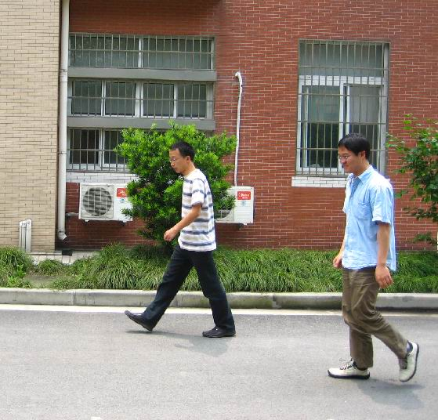
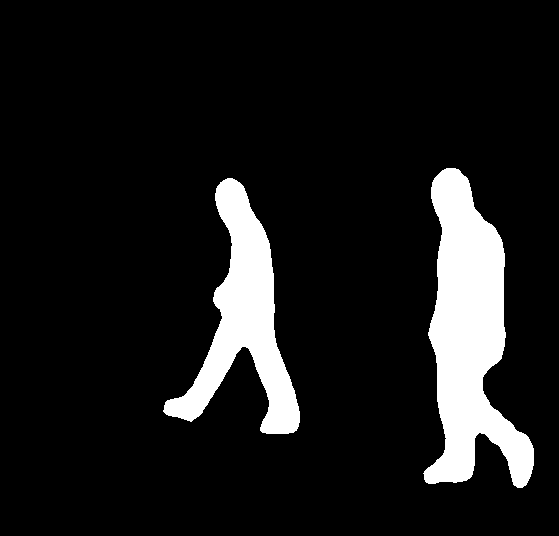

# Практическая работа №23: Метрики оценки качества сегментации и детекции изображений

> 📖 Перед началом работы ознакомьтесь со [справочником по Markdown](./MD_Instructions.md) — он пригодится для оформления отчётов.

---

## 🎯 Цель работы  
Изучить метрики оценки качества решения задачи «Сегментация и Детекция».

---

## 📌 Задачи  
- Изучить Intersection over Union (IoU). 
- Изучить mean Average Precision (mAP).  
- Изучить Dice Coefficient.

---

## 📁 Материалы и методы
- Язык программирования – Python 3.10.
- Основные библиотеки:
  -  [scikit-learn](https://scikit-learn.org/),
  -  [matplotlib](https://matplotlib.org/),
  -  [PyTorch (torch, torchvision)](https://pytorch.org/),
  -  [pydensecrf](https://github.com/lucasb-eyer/pydensecrf.git).
- Датасет – [Penn-Fudan Pedestrian Detection and Segmentation (170 изображений).](https://www.kaggle.com/datasets/psvishnu/pennfudan-database-for-pedestrian-detection-zip)

Датасет Penn-Fudan Dataset содержит 170 цветных изображений пешеходов и соответствующие маски сегментации (PNG) и аннотации прямоугольных рамок (PNG).

Каталог:

```code
PennFudanPed/
├── PNGImages/
│   ├── FudanPed00001.png
│   └── ...
└── PedMasks/
    ├── FudanPed00001_mask.png
    └── ...
```
---

## 📚 Краткая теоретическая информация  

### 📚 Сегментация

Сегментация — это процесс разделения изображения на однородные области (сегменты), каждая из которых соответствует конкретному объекту или фону.

В задаче семантической сегментации каждому пикселю присваивается категория (например, «пешеход», «дорога», «здания»).

В детекции мы работаем с ограничивающими рамками, а в сегментации нужно точно очертить форму объекта.

### 📚 Основные подходы к сегментации

1. Классические методы обработки изображений
- Пороговая сегментация (Thresholding): разделение по интенсивности яркости.
- Алгоритмы кластеризации (например, k-means): группировка пикселей по цвету или текстуре.
- Графовые методы (Graph Cut, GrabCut): минимизации энергии разметки за счёт графовых разрезов.
2. Глубокие нейронные сети
- Fully Convolutional Network (FCN): свёрточная сеть без полносвязных слоёв, выдаёт карту классов на уровне пикселей.
- U-Net: инновационная архитектура с «скачками» между кодировщиком и декодировщиком для точного восстановления границ.
- DeepLab (v3+): использует атрошные (atrous/dilated) свёртки и пространственные пирамидальные пулы (ASPP) для захвата контекста.

### 📚 Этапы работы нейросетевой сегментации
1. Подготовка данных
- Маски с разметкой каждого пикселя по классам.
- Аугментации для устойчивости модели (повороты, масштаб, сдвиги).
2. Обучение модели
- Функция потерь обычно сочетает кросс-энтропию и дополнительные термы (Dice, IoU-loss).
- Оптимизация с помощью стохастического градиентного спуска или его модификаций (Adam, SGD с моментумом).
3. Инференс и пост-обработка
- Прямое предсказание карты классов для всех пикселей.
- Сглаживание границ (CRF, морфологические операции) для устранения «шумов» на краях.

### 📚 Варианты сегментации и их особенности

| Тип сегментации | Задача | Особенности |
|-----------------|----------------|-----------------------------|
| Семантическая | Разметка пикселей по классам | Не разделяет разные экземпляры одного класса |
| Instance Segmentation | Выделение каждого объекта как отдельного | Нужны дополнительные головы предсказания маски |
| Panoptic Segmentation | Комбинация семантики и инстансов | Покрывает все пиксели и различает объекты и фон |

Глубже понять сегментацию можно изучив:
- Трансформеры в сегментации ([SegFormer](https://arxiv.org/abs/2103.13413), [SETR](https://github.com/fudan-zvg/SETR)).
- [Слабонаправленную сегментацию без пиксельной разметки](https://arxiv.org/html/2310.13026v2).
- Использование самосупервизии и контрастного обучения для предварительного обучения на неразмеченных данных.

### 📚 Теоретическая информация о метриках

Intersection over Union (IoU) – отношение площади пересечения предсказанной области и истинной области к площади их объединения.

mean Average Precision (mAP) – усреднённая площадь под кривой Precision–Recall по всем классам или по разным порогам IoU.

Dice Coefficient – мера сходства двух бинарных масок:

$$
  Dice = 2 \cdot \frac{|A \cap B|}{|A| + |B|}
$$

### ⚙️ Настройка среды

**Авторизоваться на сервере [JupyterHub](https://jupyter.org/hub) по адресу `http://<server-ip>:8000/`**

> ⚠️ Замените `<server-ip>` на IP-адрес вашего сервера (указан преподавателем).

1. Откройте браузер и перейдите по адресу `http://<server-ip>:8000/`
2. Войдите под своей учётной записью (должна была быть создана в рамках [ознакомительного занятия](./Pr_0.md), типовое имя `student_<группа>_<номер>`)


***📁 Форк проекта и Клонирование и работа через командную строку***

... были выполнены в рамках [ознакомительного занятия](./Pr_0.md)

**Перейти в рабочий каталог**

В файловом навигаторе (левая часть поля JupyterLab) необходимо
- зайти в каталог `project` -> `reports` (двойной клик мыши на названии каталога)
- создать новый каталог `Pr_23`,
- создать в `Pr_23` MarkDown-файл, сохранить его в `project/reports/Pr_23` под именем `Pr_23_report.md`; данный файл будет использован для формирования отчета;
  - для создания нужно в правой части окна JupyterLab создать новую вкладку **Launcher** и выбрать тип файла `MarkDown File`
  - для сохранения нужно нажать на клавиатуре `Ctrl+S` и ввести имя файла `Pr_23_report.md`
- аналогично создать в `Pr_23` файл `LLM_Help.ipynb` (для уточняющих вопросов)
- в левом меню вернуться в `project`, открыть в нем **Terminal**
  - переход на уровень выше осуществляется одинарным щелчком по имени каталога, размещенном над файловым менеджером в левой части JupyterLab
  - для открытия вкладки типа **Terminal** нужно нажать символ **+** в правой части JupyterLab и выбрать **Terminal**

Создайте в корне домашнего каталога каталог проекта и перейдите в него:

```bash

mkdir segmentation_detection_lab
cd segmentation_detection_lab

```
Проверьте зависимости (библиотеки уже установлены в образе):
```bash
pip list | grep -iE 'torch|torchvision|opencv|segmentation-models-pytorch|efficientnet-pytorch|densecrf'
```

## 🧪 Примеры и задания 

### 🧪 Простейшая сегментация.

**Данный пример выполняет сегментацию и размещает результаты в локальной папке `./output/PennFudanPed/`. Сначала нужно создать `evaluate_metrics.py` (в нём объявлен класс `PennFudanDataset`), потом создать `run_inference.py` (показан ниже) и запустить (команда запуска тоже приведена ниже). Только после этого запустить `evaluate_metrics.py` **

**Описание примера**
Сегментация в этом примере выполняется готовой нейросетью **Mask R-CNN** (ResNet-50 + FPN) с предобученными на COCO весами — модель применяется «как есть», без дообучения на Penn-Fudan. По каждому изображению она выдаёт бинарные маски инстансов, прямоугольные рамки и оценки их достоверности (scores); на основе этих предсказаний и разметки считаются метрики.

**Как связаны файлы (порядок важен)**

- `evaluate_metrics.py` создаётся **первым**, потому что `run_inference.py` импортирует из него класс датасета: `from evaluate_metrics import PennFudanDataset`. Без существующего `evaluate_metrics.py` скрипт `run_inference.py` не запустится — упадёт с ошибкой `ImportError` ещё до инференса.
- Оба файла создаются в рабочей папке `segmentation_detection_lab` через *nano* (как в работе №22), вставляя приведённый ниже код.
- Порядок запуска: сначала `run_inference.py` (создаёт `./output/PennFudanPed/pred_masks/*.png` и `pred_boxes.json`), затем `evaluate_metrics.py` (читает разметку и предсказания, вычисляет метрики).
- Предсказание и разметка одного изображения сопоставляются **по имени файла**: PNG-маска сохраняется с тем же именем, что и маска разметки.

1. Вычисление метрик. Файл `evaluate_metrics.py`: класс `PennFudanDataset` (загрузка изображений и масок разметки) и функции расчёта метрик. На основе маски разметки и предсказанной маски (в коде — `gt_union` и `pm_bin`) рассчитываются:
- IoU и Dice Coefficient — меры перекрытия двух бинарных областей (масок)
- mAP для прямоугольных рамок (bounding boxes): Precision–Recall, где совпадение предсказанной рамки с объектом разметки оценивается по IoU как «оценке достоверности» детекции (порог `--iou-thresh`, по умолчанию 0.5)

Код файла `evaluate_metrics.py` (класс датасета + функции метрик + `main`):

```python
#!/usr/bin/env python3
# -*- coding: utf-8 -*-

import os
import argparse
import json
import cv2
import numpy as np
import torch
from torch.utils.data import Dataset


class PennFudanDataset(Dataset):
    """
    Простой Dataset для Penn-Fudan Pedestrian
    Ожидает структуру:
      root/PNGImages   — rgb .png
      root/PedMasks    — .png-маски
    При инициализации self.img_paths и self.mask_paths
    содержат полные пути к файлам.
    """
    def __init__(self, root, transforms=None):
        self.root = root
        self.transforms = transforms

        img_dir  = os.path.join(root, "PNGImages")
        mask_dir = os.path.join(root, "PedMasks")

        # берём только файлы с .png и пропускаем всё остальное
        imgs = sorted([
            fname for fname in os.listdir(img_dir)
            if fname.lower().endswith(".png")
               and os.path.isfile(os.path.join(img_dir,  fname))
        ])
        masks = sorted([
            fname for fname in os.listdir(mask_dir)
            if fname.lower().endswith(".png")
               and os.path.isfile(os.path.join(mask_dir, fname))
        ])

        self.img_paths  = [os.path.join(img_dir,  f) for f in imgs]
        self.mask_paths = [os.path.join(mask_dir, f) for f in masks]

    def __len__(self):
        return len(self.img_paths)

    def __getitem__(self, idx):
        # Загружаем RGB-изображение
        img_path = self.img_paths[idx]
        img_bgr  = cv2.imread(img_path)
        if img_bgr is None:
            raise FileNotFoundError(f"Image not found or unreadable: {img_path}")
        img      = cv2.cvtColor(img_bgr, cv2.COLOR_BGR2RGB)

        # Загружаем маску
        mask_path = self.mask_paths[idx]
        mask_gray = cv2.imread(mask_path, cv2.IMREAD_GRAYSCALE)
        mask      = np.array(mask_gray, dtype=np.uint8)

        # Выделяем ID объектов (0 — фон)
        obj_ids = np.unique(mask)
        obj_ids = obj_ids[obj_ids != 0]

        # Бинарные маски для каждого объекта (N, H, W)
        masks = mask[None, ...] == obj_ids[:, None, None]

        # Коробки [xmin, ymin, xmax, ymax]
        boxes = []
        for m in masks:
            ys, xs = np.where(m)
            boxes.append([int(xs.min()), int(ys.min()), int(xs.max()), int(ys.max())])
        boxes = torch.as_tensor(boxes, dtype=torch.float32)

        labels   = torch.ones((len(boxes),), dtype=torch.int64)
        masks    = torch.as_tensor(masks, dtype=torch.uint8)
        image_id = torch.tensor([idx])
        area     = (boxes[:, 3] - boxes[:, 1]) * (boxes[:, 2] - boxes[:, 0])
        iscrowd  = torch.zeros((len(boxes),), dtype=torch.int64)

        target = {
            "boxes": boxes,
            "labels": labels,
            "masks": masks,
            "image_id": image_id,
            "area": area,
            "iscrowd": iscrowd
        }

        if self.transforms:
            img = self.transforms(img)

        return img, target


def compute_mask_iou(pred_mask: np.ndarray, gt_mask: np.ndarray) -> float:
    inter = np.logical_and(pred_mask, gt_mask).sum()
    union = np.logical_or(pred_mask, gt_mask).sum()
    if union == 0:
        return 1.0 if inter == 0 else 0.0
    return float(inter) / union


def compute_mask_dice(pred_mask: np.ndarray, gt_mask: np.ndarray) -> float:
    inter = np.logical_and(pred_mask, gt_mask).sum()
    total = pred_mask.sum() + gt_mask.sum()
    if total == 0:
        return 1.0 if inter == 0 else 0.0
    return 2.0 * inter / total


def compute_box_iou(boxA, boxB):
    xA = max(boxA[0], boxB[0])
    yA = max(boxA[1], boxB[1])
    xB = min(boxA[2], boxB[2])
    yB = min(boxA[3], boxB[3])

    interW = max(0, xB - xA + 1)
    interH = max(0, yB - yA + 1)
    inter  = interW * interH

    areaA = (boxA[2] - boxA[0] + 1) * (boxA[3] - boxA[1] + 1)
    areaB = (boxB[2] - boxB[0] + 1) * (boxB[3] - boxB[1] + 1)
    union = areaA + areaB - inter

    if union == 0:
        return 0.0
    return inter / union


def compute_map(predictions, ground_truths, iou_threshold=0.5):
    """
    mAP (11-point interpolation) для одного класса.
    predictions: список {"image_id": int, "boxes": [[...]], "scores": [...]}
    ground_truths: dict image_id -> list of gt boxes
    """
    all_preds = []
    total_gts = 0

    for item in predictions:
        img_id = item["image_id"]
        for b, s in zip(item["boxes"], item["scores"]):
            all_preds.append({"image_id": img_id, "box": b, "score": s})

    for img_id, boxes in ground_truths.items():
        total_gts += len(boxes)

    all_preds.sort(key=lambda x: x["score"], reverse=True)

    tp = np.zeros(len(all_preds))
    fp = np.zeros(len(all_preds))
    matched = {img_id: np.zeros(len(gt), dtype=bool)
               for img_id, gt in ground_truths.items()}

    for idx, pred in enumerate(all_preds):
        img_id, pbox = pred["image_id"], pred["box"]
        gts = ground_truths.get(img_id, [])
        ious = [compute_box_iou(pbox, gt) for gt in gts]
        if ious:
            best_idx = int(np.argmax(ious))
            if ious[best_idx] >= iou_threshold and not matched[img_id][best_idx]:
                tp[idx] = 1
                matched[img_id][best_idx] = True
            else:
                fp[idx] = 1
        else:
            fp[idx] = 1

    tp_cum = np.cumsum(tp)
    fp_cum = np.cumsum(fp)
    recalls  = tp_cum / total_gts
    precisions = tp_cum / (tp_cum + fp_cum + 1e-8)

    recall_levels = np.linspace(0, 1, 11)
    precisions_at_recall = [
        precisions[recalls >= rl].max() if np.any(recalls >= rl) else 0.0
        for rl in recall_levels
    ]
    return np.mean(precisions_at_recall)


def main(args):
    # 1) Датасет
    ds = PennFudanDataset(root=args.data_root)

    # 2) Пути к предсказаниям
    pred_mask_dir   = args.pred_mask_dir
    pred_boxes_json = args.pred_boxes_json

    # 3) Загружаем предсказанные боксы
    with open(pred_boxes_json, "r") as f:
        pred_boxes = json.load(f)

    ious, dices = [], []
    map_preds = []
    gt_boxes_dict = {}

    for idx in range(len(ds)):
        # GT
        _, target = ds[idx]
        gt_masks = target["masks"].numpy().astype(bool)
        gt_union = np.any(gt_masks, axis=0)
        gt_boxes = target["boxes"].numpy().tolist()
        gt_boxes_dict[idx] = gt_boxes

        # Предсказанная маска
        mask_name = os.path.basename(ds.mask_paths[idx])
        pm_path   = os.path.join(pred_mask_dir, mask_name)
        pm_img    = cv2.imread(pm_path, cv2.IMREAD_GRAYSCALE)
        if pm_img is None:
            raise RuntimeError(f"Не удалось прочитать {pm_path}")
        pm_bin = pm_img > 0

        ious.append(compute_mask_iou(pm_bin, gt_union))
        dices.append(compute_mask_dice(pm_bin, gt_union))

        rec = pred_boxes.get(str(idx), {})
        map_preds.append({
            "image_id": idx,
            "boxes": rec.get("boxes", []),
            "scores": rec.get("scores", [])
        })

    mAP = compute_map(map_preds, gt_boxes_dict, iou_threshold=args.iou_thresh)

    print(f"IoU (mean):  {np.mean(ious):.4f}")
    print(f"Dice (mean): {np.mean(dices):.4f}")
    print(f"mAP@{args.iou_thresh:.2f}:   {mAP:.4f}")


if __name__ == "__main__":
    parser = argparse.ArgumentParser(
        description="Evaluate IoU, Dice and mAP on Penn-Fudan dataset"
    )
    parser.add_argument(
        "--data-root", type=str, required=True,
        help="Корень PennFudanPed (с папками PNGImages и PedMasks)"
    )
    parser.add_argument(
        "--pred-mask-dir", type=str, required=True,
        help="Папка с бинарными предсказанными масками"
    )
    parser.add_argument(
        "--pred-boxes-json", type=str, required=True,
        help="JSON с предсказанными боксами {image_id: {boxes: [...], scores: [...]}}"
    )
    parser.add_argument(
        "--iou-thresh", type=float, default=0.5,
        help="Порог IoU для mAP"
    )
    args = parser.parse_args()

    main(args)

```

**📖 Что происходит в коде**

- `PennFudanDataset(Dataset)` — обёртка над каталогом `PennFudanPed`: при инициализации собирает отсортированные списки `.png`-файлов из `PNGImages/` и `PedMasks/`. Соответствие «изображение ↔ маска» — по совпадению имен (шаблон `FudanPedNNNNN.png` / `FudanPedNNNNN_mask.png`) и порядку в отсортированных списках.
- `__getitem__(idx)` — загружает пару: изображение (OpenCV, перевод BGR→RGB) и маску (grayscale). `np.unique(mask)` даёт ID объектов (0 — фон, исключается); для каждого объекта строится бинарная маска `mask == id` — форма пешехода. `np.where` находит координаты пикселей объекта → рамка `[xmin, ymin, xmax, ymax]`. `labels` — единицы (один класс «пешеход»), `area` — площадь рамки, `iscrowd` — ноль. Возвращаемый `target` — словарь в формате torchvision detection; в примере из него используются `masks` и `boxes` (ground truth для метрик).
- `compute_mask_iou` / `compute_mask_dice` — пиксельные метрики двух бинарных масок: пересечение через `np.logical_and`, для IoU объединение через `np.logical_or`, для Dice — сумма площадей. Если обе маски пусты, возвращают 1.0 («совпадение»).
- `compute_box_iou` — IoU двух прямоугольников `[x1, y1, x2, y2]`: пересечение через `max`/`min` по координатам углов (`+1` — границы рамки включены), затем `inter / union`.
- `compute_map` — AP для одного класса по всем изображениям: все предсказанные рамки раскладываются в плоский список и сортируются по убыванию score; каждая рамка сопоставляется с лучшей (по IoU) GT-рамкой **того же изображения** по правилу one-to-one — уже «занятая» GT-рамка больше не используется. TP, если IoU ≥ порога, иначе FP. По накопленным TP/FP считаются precision и recall, из кривой берётся 11-точечная интерполяция (схема Pascal VOC 2007), её среднее — AP.
- `main(args)`: для каждого изображения берётся union-маска разметки (`np.any` по инстансам — `gt_union`) и предсказанная PNG-маска **с тем же именем** (бинаризуется порогом `> 0` — `pm_bin`); накапливаются IoU/Dice. Рамки и scores читаются из JSON по ключу `str(idx)`. В конце выводятся средние по всем изображениям.
- Аргументы командной строки: `--data-root` — корень `PennFudanPed` (папки `PNGImages`/`PedMasks`); `--pred-mask-dir` — папка с предсказанными масками; `--pred-boxes-json` — JSON с рамками и scores; `--iou-thresh` — порог IoU для mAP (по умолчанию 0.5).

**📌 Ожидаемый результат**
Три строки вывода — `IoU (mean)`, `Dice (mean)`, `mAP@0.50` — средние значения по всем 170 изображениям, числа в диапазоне 0–1. Значения умеренные: модель предобучена на COCO и не дообучена на пешеходах Penn-Fudan.

2. Генерация предсказанной маски. Скрипт `run_inference.py`
```python
#!/usr/bin/env python3
import os
import json
import cv2
import numpy as np
import torch
from torchvision import transforms as T
from torchvision.models.detection import maskrcnn_resnet50_fpn
from evaluate_metrics import PennFudanDataset  # ваш класс из evaluate_metrics.py

def main(data_root, pred_mask_dir, pred_boxes_path, device="cpu"):
    # 1) Подготовка
    os.makedirs(pred_mask_dir, exist_ok=True)
    ds = PennFudanDataset(root=data_root)
    model = maskrcnn_resnet50_fpn(pretrained=True).to(device).eval()
    transform = T.Compose([T.ToTensor()])

    pred_boxes = {}

    for idx in range(len(ds)):
        img, _ = ds[idx]                          # img — numpy RGB
        img_t = transform(img).to(device).unsqueeze(0)

        # 2) Инференс
        with torch.no_grad():
            out = model(img_t)[0]

        boxes  = out["boxes"].cpu().numpy().tolist()
        scores = out["scores"].cpu().numpy().tolist()

        # 3) Собираем union-маску всех инстансов
        masks = (out["masks"].cpu().numpy() > 0.5).squeeze(1)  # (N,H,W)
        if masks.ndim == 2:  # если всего один объект
            union = masks.astype(np.uint8)
        else:
            union = np.any(masks, axis=0).astype(np.uint8)

        # 4) Сохраняем маску как PNG (0 или 255)
        mask_name = os.path.basename(ds.mask_paths[idx])
        mask_out  = (union * 255).astype(np.uint8)
        cv2.imwrite(os.path.join(pred_mask_dir, mask_name), mask_out)

        # 5) Заполняем словарь для JSON
        pred_boxes[str(idx)] = {
            "boxes":  boxes,
            "scores": scores
        }

    # 6) Сохраняем JSON
    with open(pred_boxes_path, "w") as f:
        json.dump(pred_boxes, f, indent=2)
    print("Inference done.")

if __name__ == "__main__":
    import argparse
    p = argparse.ArgumentParser()
    p.add_argument("--data-root",       required=True,
                   help="Путь к PennFudanPed")
    p.add_argument("--pred-mask-dir",   required=True,
                   help="Куда сохранить предсказанные маски")
    p.add_argument("--pred-boxes-json", required=True,
                   help="Куда сохранить предсказанные боксы (JSON)")
    args = p.parse_args()
    main(args.data_root, args.pred_mask_dir, args.pred_boxes_json)

```

**📖 Что происходит в коде**

- `from evaluate_metrics import PennFudanDataset` — импорт класса датасета из первого файла: ещё одна причина, почему `evaluate_metrics.py` должен существовать в той же папке **до** запуска этого скрипта.
- `maskrcnn_resnet50_fpn(pretrained=True)` — готовая модель Mask R-CNN (энкодер ResNet-50 + FPN) с весами, предобученными на COCO; `.eval()` и `torch.no_grad()` — режим инференса: модель не обучается и не дообучается.
- Цикл по изображениям: RGB-массив из датасета → `T.ToTensor()` → `unsqueeze(0)` (батч из одного изображения) → `model(img_t)[0]` — словарь выходов модели.
- `out["boxes"]` и `out["scores"]` — предсказанные рамки и оценки их достоверности; `out["masks"] > 0.5` — бинарные маски инстансов `(N,H,W)`. Если объект всего один (`masks.ndim == 2`), union-маска — она сама, иначе `np.any` по всем инстансам (объединение форм).
- PNG-маска сохраняется с именем маски разметки (`os.path.basename(ds.mask_paths[idx])`) — по этому имени `evaluate_metrics.py` найдёт предсказание для изображения. Значения пикселей — 0 или 255.
- `pred_boxes[str(idx)] = {"boxes": ..., "scores": ...}` — словарь для JSON; ключ — номер изображения **как строка** (ключи JSON могут быть только строки).

Его запуск из рабочей папки студента `segmentation_detection_lab`:

```bash
python run_inference.py \
  --data-root       ~/data/PennFudanPed \
  --pred-mask-dir   ./output/PennFudanPed/pred_masks \
  --pred-boxes-json ./output/PennFudanPed/pred_boxes.json
```

Аргументы: `--data-root` — каталог датасета `PennFudanPed` (с папками `PNGImages/` и `PedMasks/`); `--pred-mask-dir` — папка для PNG-масок (создаётся скриптом автоматически); `--pred-boxes-json` — файл, куда пишутся рамки и scores. Итог этапа — `./output/PennFudanPed/pred_masks/` и `pred_boxes.json`.

Запуск `evaluate_metrics.py` из командной строки:

```bash
python evaluate_metrics.py \
  --data-root       ~/data/PennFudanPed \
  --pred-mask-dir   ./output/PennFudanPed/pred_masks \
  --pred-boxes-json ./output/PennFudanPed/pred_boxes.json
```

Аргументы те же — путь к датасету и к файлам предсказаний, созданным первым этапом; `--iou-thresh` задаёт порог IoU для mAP (по умолчанию 0.5).

**📌 Ожидаемый результат**
Три строки: `IoU (mean)`, `Dice (mean)`, `mAP@0.50` — средние по всем 170 изображениям (числа 0–1).

После этого в каталоге `./output/PennFudanPed/pred_masks` будут созданы PNG-маски:
   
   

а в `pred_boxes.json` — структура

```json

{
  "0": { "boxes": [[x1,y1,x2,y2],...], "scores": [s1, s2, ...] },
  "1": { ... }
}

```

Структура входных данных для `evaluate_metrics.py`: ключ — номер изображения (строка), `boxes` — рамки `[x1, y1, x2, y2]`, `scores` — оценка достоверности каждой рамки (те же значения, что в `out["boxes"]`/`out["scores"]` при инференсе).

### 📌 Задание для самостоятельной работы #1

Требуется:
1. Реализовать вычисление mAP детекции по диапазону порогов IoU (от 0.5 до 0.95 с шагом 0.05).
2. Сравнить mAP при разных порогах и построить график зависимости.

Заготовка для выполнения задания `task_map.py`:

```python
import os
import numpy as np
from sklearn.metrics import average_precision_score

# TODO: импортировать функции compute_iou и загрузку датасета

def compute_map_at_thresholds(gt_boxes, pred_boxes, iou_thresholds):
    """
    Возвращает список AP для каждого порога IoU из iou_thresholds.
    gt_boxes и pred_boxes – списки списков прямоугольников на каждом изображении.
    """
    ap_values = []
    for thr in iou_thresholds:
        # TODO: для каждого изображения вычислить IoU матрицу,
        # затем определить TP/FP по правилу IoU>=thr, собрать метки и оценки
        # и вызвать average_precision_score
        ap = 0.0  # заменить на вычисленное
        ap_values.append(ap)
    return ap_values

def main():
    iou_thresholds = np.arange(0.5, 1.0, 0.05)
    # TODO: загрузить gt_boxes и pred_boxes
    gt_boxes = []     # список списков: [[box1, box2, ...], ...]
    pred_boxes = []   # тот же формат плюс оценки confidences
    
    ap_list = compute_map_at_thresholds(gt_boxes, pred_boxes, iou_thresholds)

    # TODO: построить график iou_thresholds vs ap_list
    # и сохранить в файл map_vs_iou.png

if __name__ == "__main__":
    main()
```

**💡 Как подойти к заданию**

1. **Данные.** GT-рамки — через `PennFudanDataset` (из `evaluate_metrics.py`): `target["boxes"]` для каждого `idx`. Предсказания — из `./output/PennFudanPed/pred_boxes.json` (создаётся `run_inference.py`); ключи в JSON — строки `"0"`, `"1"`, …, приведите их к `int`.
2. **IoU.** Переиспользуйте готовую функцию: `from evaluate_metrics import PennFudanDataset, compute_box_iou`.
3. **Цикл по порогам.** Для каждого порога 0.5–0.95 с шагом 0.05: разверните все предсказания всех изображений в плоский список и отсортируйте по убыванию score; для каждой рамки найдите лучшую GT-рамку того же изображения — TP, если IoU ≥ порога и эта GT ещё не «занята», иначе FP (то же правило, что в `compute_map` примера). Собранные `y_true` и `y_scores` передайте в `average_precision_score` (импорт уже есть в заготовке) — или повторите 11-точечную интерполяцию, как в `compute_map`.
4. **График.** `plt.plot(iou_thresholds, ap_list, marker="o")` + подписи осей + сетка + `plt.savefig("map_vs_iou.png")`.
5. **Интерпретация.** AP монотонно падает с ростом порога IoU: строже критерий совпадения рамки с объектом — меньше истинных положительных.

Структуру заготовки менять не нужно — заполняйте только блоки `TODO`.

<!-- ANSWER
```python
#!/usr/bin/env python3
# -*- coding: utf-8 -*-

import os
import json
import numpy as np
import matplotlib.pyplot as plt
from sklearn.metrics import average_precision_score

# Импортируем класс датасета и функцию вычисления IoU из вашего файла evaluate_metrics
from evaluate_metrics import PennFudanDataset, compute_box_iou

def compute_map_at_thresholds(gt_boxes_dict, pred_boxes_dict, iou_thresholds):
    """
    Возвращает список AP для каждого порога IoU из iou_thresholds.
    gt_boxes_dict: dict {image_id: [[x1,y1,x2,y2], ...]}
    pred_boxes_dict: dict {image_id: {"boxes": [[...]], "scores": [...]}}
    """
    ap_values = []
    
    # Собираем все предсказания в один плоский список для сортировки по уверенности
    all_preds = []
    for img_id, data in pred_boxes_dict.items():
        boxes = data.get("boxes", [])
        scores = data.get("scores", [])
        for b, s in zip(boxes, scores):
            all_preds.append({"image_id": img_id, "box": b, "score": s})
            
    # Если предсказаний вообще нет, возвращаем нули
    if not all_preds:
        return [0.0] * len(iou_thresholds)
        
    # Сортируем все предсказания по убыванию score (как в классическом mAP)
    all_preds.sort(key=lambda x: x["score"], reverse=True)
    
    # Считаем общее количество истинных объектов по всему датасету
    total_gts = sum(len(boxes) for boxes in gt_boxes_dict.values())
    if total_gts == 0:
        return [1.0] * len(iou_thresholds)

    for thr in iou_thresholds:
        tp = np.zeros(len(all_preds))
        fp = np.zeros(len(all_preds))
        
        # Словарь для отслеживания уже сопоставленных истинных объектов на каждом изображении
        matched_gts = {img_id: np.zeros(len(boxes), dtype=bool) for img_id, boxes in gt_boxes_dict.items()}
        
        for idx, pred in enumerate(all_preds):
            img_id = pred["image_id"]
            pbox = pred["box"]
            gts = gt_boxes_dict.get(img_id, [])
            
            if len(gts) == 0:
                fp[idx] = 1
                continue
                
            # Считаем IoU со всеми истинными объектами на этом кадре
            ious = [compute_box_iou(pbox, gt) for gt in gts]
            best_gt_idx = np.argmax(ious)
            best_iou = ious[best_gt_idx]
            
            # Критерий True Positive: IoU выше порога и этот истинный объект еще не был занят
            if best_iou >= thr and not matched_gts[img_id][best_gt_idx]:
                tp[idx] = 1
                matched_gts[img_id][best_gt_idx] = True  # Объект "занят"
            else:
                fp[idx] = 1
                
        # Накапливаем TP и FP для построения PR-кривой
        tp_cum = np.cumsum(tp)
        fp_cum = np.cumsum(fp)
        
        recalls = tp_cum / total_gts
        precisions = tp_cum / (tp_cum + fp_cum + 1e-8)
        
        # Используем 11-точечную интерполяцию, как в коде вашего примера evaluate_metrics.py
        recall_levels = np.linspace(0, 1, 11)
        precisions_at_recall = [
            precisions[recalls >= rl].max() if np.any(recalls >= rl) else 0.0 
            for rl in recall_levels
        ]
        ap = float(np.mean(precisions_at_recall))
        ap_values.append(ap)
        
    return ap_values

def main():
    # Задаем пути (измените, если пути в вашей лабораторной отличаются)
    data_root = os.path.expanduser("~/data/PennFudanPed")
    pred_boxes_json = "./output/PennFudanPed/pred_boxes.json"
    
    if not os.path.exists(pred_boxes_json):
        raise FileNotFoundError(f"Файл предсказаний не найден по пути {pred_boxes_json}. Сначала запустите инференс!")

    # 1. Загрузка разметки (Ground Truth) через класс датасета
    print("Загрузка датасета...")
    ds = PennFudanDataset(root=data_root)
    gt_boxes_dict = {}
    for idx in range(len(ds)):
        _, target = ds[idx]
        # Переводим в int/float списки для совместимости
        gt_boxes_dict[idx] = target["boxes"].numpy().tolist()

    # 2. Загрузка предсказаний моделей (Predictions)
    print("Загрузка предсказаний из JSON...")
    with open(pred_boxes_json, "r") as f:
        raw_pred_boxes = json.load(f)
    
    # Приводим ключи к типу int, так как в JSON они сохранились как строки "0", "1" и т.д.
    pred_boxes_dict = {int(k): v for k, v in raw_pred_boxes.items()}

    # 3. Вычисление mAP для диапазона порогов IoU от 0.5 до 0.95 с шагом 0.05
    iou_thresholds = np.arange(0.5, 1.0, 0.05)
    print("Вычисление значений mAP по порогам IoU...")
    ap_list = compute_map_at_thresholds(gt_boxes_dict, pred_boxes_dict, iou_thresholds)
    
    # Вывод результатов в консоль для наглядности
    print("\nРезультаты:")
    print("Порог IoU | mAP (AP)")
    print("--------------------")
    for thr, ap in zip(iou_thresholds, ap_list):
        print(f"   {thr:.2f}   |  {ap:.4f}")

    # 4. Построение графика зависимости mAP от IoU
    print("\nПостроение графика...")
    plt.figure(figsize=(8, 5))
    plt.plot(iou_thresholds, ap_list, marker='o', color='b', linestyle='-', linewidth=2)
    plt.title('Зависимость mAP от порога IoU', fontsize=14)
    plt.xlabel('Порог IoU (Intersection over Union)', fontsize=12)
    plt.ylabel('mAP (Average Precision)', fontsize=12)
    plt.grid(True, linestyle='--', alpha=0.7)
    plt.xticks(iou_thresholds)
    plt.ylim(-0.05, 1.05)
    
    # Сохраняем график в файл
    output_plot_path = "map_vs_iou.png"
    plt.savefig(output_plot_path, dpi=300, bbox_inches='tight')
    plt.close()
    print(f"График успешно сохранен в файл: {output_plot_path}")

if __name__ == "__main__":
    main()
```
-->

### 🧪 Пример 2. Сегментация с использованием готовых моделей

Ниже пример скрипта `segment_smp_compare.py`, который берет библиотеку `segmentation_models_pytorch` и сравнивает сразу несколько готовых архитектур (U-Net, FPN, DeepLabV3) с предобученными энкодерами.

Библиотека `segmentation_models_pytorch` (smp) собирает готовую модель сегментации: энкодер, предобученный на ImageNet, + декодер выбранной архитектуры. В примере сравниваются три архитектуры на одном энкодере `resnet34` **без обучения на Penn-Fudan** — скрипт показывает пайплайн сравнения моделей и их уровень «из коробки».

```python

#!/usr/bin/env python3
# -*- coding: utf-8 -*-

import os
os.environ['GLOG_minloglevel'] = '2'  # 0=INFO,1=WARNING,2=ERROR
import argparse

import torch
import numpy as np
import cv2

from torch.utils.data import Dataset, DataLoader
from torchvision.io import read_image

import segmentation_models_pytorch as smp

import math
import torch.nn.functional as F


class PennFudanSegDataset(Dataset):
    """
    Dataset: возвращает
      img [3,H,W] float32 ∈ [0,1]
      gt_mask [H,W] uint8 {0,1}
    """
    def __init__(self, root):
        self.img_dir  = os.path.join(root, "PNGImages")
        self.mask_dir = os.path.join(root, "PedMasks")
        
        # берём только файлы с .png и пропускаем всё остальное
        self.imgs = sorted([
            fname for fname in os.listdir(self.img_dir)
            if fname.lower().endswith(".png")
               and os.path.isfile(os.path.join(self.img_dir,  fname))
        ])
        self.masks = sorted([
            fname for fname in os.listdir(self.mask_dir)
            if fname.lower().endswith(".png")
               and os.path.isfile(os.path.join(self.mask_dir, fname))
        ])

    def __len__(self):
        return len(self.imgs)

    def __getitem__(self, idx):
        img_path  = os.path.join(self.img_dir,  self.imgs[idx])
        mask_path = os.path.join(self.mask_dir, self.masks[idx])

        img = read_image(img_path).float() / 255.0    # [3,H,W]
        mask = read_image(mask_path)[0]               # [H,W], uint8 0..255
        gt_mask = (mask > 0).to(torch.uint8)         # {0,1}

        # вычисляем паддинг
        _, H, W = img.shape
        new_H = math.ceil(H / 32) * 32
        new_W = math.ceil(W / 32) * 32
        pad_h = new_H - H
        pad_w = new_W - W
        # pad = (pad_left, pad_right, pad_top, pad_bottom)
        pad = (0, pad_w, 0, pad_h)

        # паддим изображение (цветной тензор)
        img = F.pad(img, pad, mode='constant', value=0.0)

        # паддим маску: сначала добавим канал, потом уберём
        mask = F.pad(gt_mask.unsqueeze(0).float(), pad, mode='constant', value=0.0)
        gt_mask = (mask.squeeze(0) > 0).to(torch.uint8)

        return img, gt_mask, self.imgs[idx]


def compute_iou(a: np.ndarray, b: np.ndarray) -> float:
    inter = np.logical_and(a, b).sum()
    union = np.logical_or(a, b).sum()
    return float(inter / union) if union else 1.0


def compute_dice(a: np.ndarray, b: np.ndarray) -> float:
    inter = np.logical_and(a, b).sum()
    tot   = a.sum() + b.sum()
    return float(2*inter / tot) if tot else 1.0


def evaluate_model(model, loader, device):
    model.to(device).eval()
    ious, dices = [], []

    with torch.no_grad():
        for imgs, gt_masks, _ in loader:
            # imgs: [B,3,H,W], gt_masks: [B,H,W]
            imgs = imgs.to(device)

            # 1) получаем выход
            outs = model(imgs)

            # 2) если вдруг модель возвращает dict (на будущее)
            if isinstance(outs, dict):
                outs = outs.get("out", outs)

            # 3) приводим к вероятностям [B,H,W]
            if outs.ndim == 4:
                # [B,1,H,W] → [B,H,W]
                probs = torch.sigmoid(outs)[:, 0, :, :].cpu().numpy()
            else:
                # [B,H,W]
                probs = torch.sigmoid(outs).cpu().numpy()

            # 4) вычисляем метрики по каждому элементу батча
            gts = gt_masks.numpy().astype(np.uint8)
            for pred_prob, gt in zip(probs, gts):
                pred_mask = (pred_prob > 0.5).astype(np.uint8)
                ious.append(compute_iou(pred_mask, gt))
                dices.append(compute_dice(pred_mask, gt))

    return float(np.mean(ious)), float(np.mean(dices))


def main(data_root, batch_size):
    device = "cpu"

    ds = PennFudanSegDataset(data_root)
    loader = DataLoader(ds, batch_size=batch_size, shuffle=False)

    architectures = {
        "Unet-R34":  smp.Unet(
                         encoder_name="resnet34",
                         encoder_weights="imagenet",
                         in_channels=3,
                         classes=1
                     ),
        "FPN-R34":   smp.FPN(
                         encoder_name="resnet34",
                         encoder_weights="imagenet",
                         in_channels=3,
                         classes=1
                     ),
        "DeepLabV3": smp.DeepLabV3(
                         encoder_name="resnet34",
                         encoder_weights="imagenet",
                         in_channels=3,
                         classes=1
                     ),
    }

    print(f"Dataset size: {len(ds)}, batch_size={batch_size}\n")
    print("Architecture |  Mean IoU  | Mean Dice")
    print("---------------------------------------")
    for name, model in architectures.items():
        iou, dice = evaluate_model(model, loader, device)
        print(f"{name:12} |   {iou:.4f}   |   {dice:.4f}")


if __name__ == "__main__":
    p = argparse.ArgumentParser()
    p.add_argument("--data-root",  required=True,
                   help="PennFudanPed root (PNGImages + PedMasks)")
    p.add_argument("--batch-size", type=int, default=4)
    args = p.parse_args()
    main(args.data_root, args.batch_size)


```

**📖 Что происходит в коде**

- `os.environ['GLOG_minloglevel'] = '2'` — подавляет информационные сообщения сторонних библиотек (glog), чтобы вывод не засорялся (тот же `export` в команде запуска).
- `PennFudanSegDataset`: изображение — `read_image` → тензор `[3,H,W]`, делится на 255 → значения в `[0,1]`; маска — её первый канал, бинаризация `> 0` → `{0,1}` (объединение всех пешеходов). Размер изображения приводится паддингом до кратного 32 (дополняются только правая и нижняя стороны: `pad=(0, pad_w, 0, pad_h)`): энкодеры уменьшают размерность в 32 раза, иначе выход модели не совпадёт с входом по размеру.
- `compute_iou` / `compute_dice` — те же пиксельные метрики, что и в первом примере, для двух бинарных масок.
- `evaluate_model`: `model.to(device).eval()` + `torch.no_grad()`; выход модели — логиты `[B,1,H,W]` (вариант `[B,H,W]` обрабатывается отдельно) → `sigmoid` → вероятности; порог 0.5 → предсказанная маска. IoU и Dice считаются по каждому изображению батча, возвращаются средние.
- `architectures` — три модели на одном энкодере `resnet34` (ImageNet-веса): `smp.Unet`, `smp.FPN`, `smp.DeepLabV3`; `classes=1` — бинарная сегментация «пешеход / фон».
- ⚠️ Энкодер предобучен на ImageNet, но **декодер в этом примере не обучается** — метрики показывают уровень моделей «из коробки», а не качество дообученной модели.

Запуск:

```bash

export GLOG_minloglevel=2
python segment_smp_compare.py --data-root ~/data/PennFudanPed --batch-size 1

```

`export GLOG_minloglevel=2` — то же подавление предупреждений, что и в скрипте; `--batch-size 1` — на CPU достаточно батча из одного изображения (экономия памяти).

**📌 Ожидаемый результат**
Таблица `Architecture | Mean IoU | Mean Dice` с тремя строками (`Unet-R34`, `FPN-R34`, `DeepLabV3`). Значения невысокие и близкие между собой: модели не адаптированы к задаче Penn-Fudan, поэтому метрики в первую очередь отражают баланс «пешеход / фон».

---

## 📌 Отчёт 

Выполняется в созданном ранее файле `~/project/reports/Pr_23/Pr_23_report.md`

1. Вставьте все команды, введенные в командную строку и ответы Terminal
2. Добавьте комментарии по выполненной работе
3. Подготовьте и впишите в конец файла ответы на контрольные вопросы из раздела «Контрольные вопросы» (находятся в конце данных методических указаний)
4. Сохраните в `reports/Pr_23/Pr_23_report.md`
5. Загрузите в репозиторий и отправьте:

```bash
git add . && git commit -m "Pr_23 report" && git push
```

> 📖 Используйте [справочник по Markdown](./MD_Instructions.md) для оформления.

---

> ⏳ Оценка запустится автоматически в GitLab CI. Результат появится в разделе **CI/CD → Pipelines**.


---

## Контрольные вопросы
1. Как меняется среднее значение IoU и Dice при различных способах генерации предсказания маски?
2. В чем отличие поведения IoU и Dice, когда предсказанные маски содержат "шумы" по краям?
3. Почему mAP (AP) зависит от выбранного порога IoU?
4. Какие особенности расчёта mAP делают его более информативным на многообъектных изображениях?
5. Какие области применения больше выигрывают от использования Dice Coefficient вместо IoU, и почему?
6. Как повлияет несбалансированность классов (разное число объектов каждого класса) на mAP?
