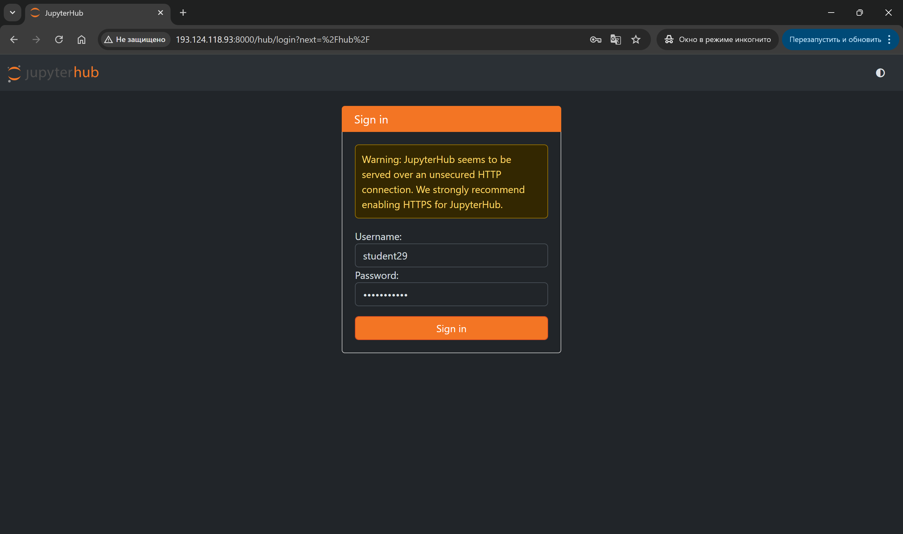

# Практическая работа №27: Генерация текста. Метрики качества. 2 часа

---

## 🎯 Цель работы  
Познакомиться с основными метриками оценки качества систем генерации текста: BLEU, ROUGE и Perplexity.

---

## 📌 Задачи  
- Изучить принципы расчёта метрики BLEU.
- Изучить принципы расчёта метрик ROUGE (ROUGE-N, ROUGE-L).
- Изучить метрику Perplexity для языковых моделей.

---

## 📁 Материалы и методы
- Язык программирования – Python 3.10.
- Основные библиотеки:
  - [matplotlib](https://matplotlib.org/),
  - [scikit-learn](https://scikit-learn.org/),
  - [rouge-score (для расчёта ROUGE)](https://github.com/google-research/google-research/tree/master/rouge)
  - [nltk (для расчёта BLEU)](https://www.nltk.org/).
- Датасет
Для экспериментов возьмём небольшой корпус из 50 пар «reference–hypothesis» из данных nltk. Каждая строка содержит одну эталонную и одну сгенерированную системой фразу.

> Все необходимые NLTK-ресурсы уже предзагружены в образе JupyterHub в `/usr/share/nltk_data`, поэтому в скриптах этой работы не используются `nltk.download`.

---

## 📚 Краткая теоретическая информация  

Генерация текста предполагает, что система создаёт последовательность слов на основе некоторого входа. Оценить её качество можно с помощью автоматических метрик, которые сопоставляют сгенерированный текст с эталонным (reference).

1. 📚 BLEU (Bilingual Evaluation Understudy) измеряет точность n-грамм. Основная формула выглядит так:

$$
  BLUE = BP \cdot \exp(\sum_{n=1}^N w_n \log p_n)
$$

где 𝑝_𝑛 — точность n-грамм, 𝑤_𝑛 — вес n-грамм, BP — штраф за слишком короткий гипотезный текст.

2. 📚 ROUGE (Recall-Oriented Understudy for Gisting Evaluation) ориентирован на полноту: ROUGE-N для n-грамм, ROUGE-L для лонгест общей подпоследовательности. Например, ROUGE-N рассчитывается как

$$
  ROUGE_N = \frac{\sum_{gram_n \in Ref} min(count_{Ref}, count_{Hyp})}{\sum_{gram_n \in Ref} count_{Ref}}
$$

3. 📚 Perplexity (перплексия) измеряет, насколько хорошо языковая модель предсказывает текст. Для последовательности 𝑊=𝑤_1…𝑤_𝑁:

$$
  Perplexity(W) = P(W)^{-1/N}
$$

где 𝑃(𝑊) — вероятность генерации всей последовательности моделью.


---
 
### ⚙️ Настройка среды

**Авторизоваться на сервере [JupyterHub](https://jupyter.org/hub) по адресу `http://<server-ip>:8000/`**

> ⚠️ Замените `<server-ip>` на IP-адрес вашего сервера (указан преподавателем).

1. Откройте браузер и перейдите по адресу `http://<server-ip>:8000/`
2. Войдите под своей учётной записью (должна была быть создана в рамках [ознакомительного занятия](./Pr_0.md), типовое имя `student_<группа>_<номер>`)



***📁 Форк проекта и Клонирование и работа через командную строку***

... были выполнены в рамках [ознакомительного занятия](./Pr_0.md)

**Перейти в рабочий каталог**

В файловом навигаторе (левая часть поля JupyterLab) необходимо
- зайти в каталог `project` -> `reports` (двойной клик мыши на названии каталога)
- создать новый каталог `Pr_27`,
- создать в `Pr_27` MarkDown-файл, сохранить его в `project/reports/Pr_27` под именем `Pr_27_report.md`; данный файл будет использован для формирования отчета;
  - для создания нужно в правой части окна JupyterLab создать новую вкладку **Launcher** и выбрать тип файла `MarkDown File`
  - для сохранения нужно нажать на клавиатуре `Ctrl+S` и ввести имя файла `Pr_27_report.md`
- аналогично создать в `Pr_27` файл `LLM_Help.ipynb` (для уточняющих вопросов)
- в левом меню вернуться в `project`, открыть в нем **Terminal**
  - переход на уровень выше осуществляется одинарным щелчком по имени каталога, размещенном над файловым менеджером в левой части JupyterLab
  - для открытия вкладки типа **Terminal** нужно нажать символ **+** в правой части JupyterLab и выбрать **Terminal**
    
1. Создайте в корне домашнего каталога каталог проекта и перейдите в него:
```bash

mkdir text_eval_lab && cd text_eval_lab
mkdir results data

```
2. Проверьте зависимости (библиотеки уже установлены в образе):
```bash
pip list | grep -iE 'scikit-learn|matplotlib|nltk|rouge-score'
```

4. Загрузка датасета

Этот скрипт создаёт в папке data/ два файла:
- `ref.txt` — 50 случайных предложений из корпуса Brown;
- `hyp.txt` — «искажённые» версии тех же предложений (нижний регистр + удалённое случайное слово).

```python

#!/usr/bin/env python3
# file: prepare_data.py

import os
import random

# Используем предзагруженные NLTK-ресурсы из образа JupyterHub.
os.environ.setdefault("NLTK_DATA", "/usr/share/nltk_data")

from nltk.corpus import brown

# 1. Create directories if missing
os.makedirs('data', exist_ok=True)
os.makedirs('results', exist_ok=True)

# 2. Sample 50 sentences from Brown Corpus
random.seed(42)
sentences = list(brown.sents())
sample = random.sample(sentences, 50)

# 3. Write reference sentences
with open('data/ref.txt', 'w', encoding='utf-8') as f_ref:
    for sent in sample:
        f_ref.write(' '.join(sent) + '\n')

# 4. Generate hypotheses by lowercasing and dropping one random word
def perturb(sentence: str) -> str:
    tokens = sentence.split()
    if len(tokens) > 3:
        idx = random.randrange(len(tokens))
        tokens.pop(idx)
    return ' '.join(tokens).lower()

with open('data/hyp.txt', 'w', encoding='utf-8') as f_hyp:
    for sent in sample:
        orig = ' '.join(sent)
        f_hyp.write(perturb(orig) + '\n')

print('Корпус подготовлен: data/ref.txt и data/hyp.txt (50 строк каждая).')
print('Каталоги data/ и results/ созданы.')

```

Запуск скрипта

```bash

python prepare_data.py

```

После этого в `data/` появятся два файла с примерами, а в корне есть пустой каталог `results/` для сохранения графиков и отчётов.

---

## 🧪 Примеры

### 🧪 Оценка BLEU (файл evaluate_bleu.py)

```python
#!/usr/bin/env python3
# file: evaluate_bleu.py

import sys
import nltk
from nltk.translate.bleu_score import corpus_bleu
from matplotlib import pyplot as plt

def load_sentences(path):
    return [line.strip().split() for line in open(path, encoding='utf-8')]

if __name__ == '__main__':
    ref_path, hyp_path, out_png = sys.argv[1], sys.argv[2], sys.argv[3]
    references = [[sent] for sent in load_sentences(ref_path)]
    hypotheses = load_sentences(hyp_path)
    bleu_score = corpus_bleu(references, hypotheses) * 100
    print(f'BLEU score: {bleu_score:.2f}')
    plt.bar(['BLEU'], [bleu_score])
    plt.ylim(0, 100)
    plt.savefig(out_png)

```


Запуск из командной строки:

```bash
python evaluate_bleu.py data/ref.txt data/hyp.txt results/bleu.png
```

### 🧪 Пример 2. Оценка ROUGE (файл evaluate_rouge.py)

```python

#!/usr/bin/env python3
# file: evaluate_rouge.py

import sys
from rouge_score import rouge_scorer
from matplotlib import pyplot as plt

if __name__ == '__main__':
    ref_path, hyp_path, out_png = sys.argv[1], sys.argv[2], sys.argv[3]
    refs = open(ref_path, encoding='utf-8').read().splitlines()
    hyps = open(hyp_path, encoding='utf-8').read().splitlines()
    scorer = rouge_scorer.RougeScorer(['rouge1','rougeL'], use_stemmer=True)
    scores = [scorer.score(r, h) for r, h in zip(refs, hyps)]
    avg_rouge1 = sum(s['rouge1'].fmeasure for s in scores) / len(scores) * 100
    avg_rougeL = sum(s['rougeL'].fmeasure for s in scores) / len(scores) * 100
    print(f'ROUGE-1: {avg_rouge1:.2f}, ROUGE-L: {avg_rougeL:.2f}')
    plt.bar(['ROUGE-1','ROUGE-L'], [avg_rouge1, avg_rougeL])
    plt.ylim(0,100)
    plt.savefig(out_png)

```

Запуск:

```bash

python evaluate_rouge.py data/ref.txt data/hyp.txt results/rouge.png

```

### 🧪 Пример 3. Оценка Perplexity (файл evaluate_perplexity.py)

```python

#!/usr/bin/env python3
# file: evaluate_perplexity.py

import sys
import math
import os
from collections import defaultdict

# Используем предзагруженные NLTK-ресурсы из образа JupyterHub.
os.environ.setdefault("NLTK_DATA", "/usr/share/nltk_data")

from nltk.tokenize import TreebankWordTokenizer
from matplotlib import pyplot as plt

def build_ngram_counts(sentences, n=3):
    counts = defaultdict(int)
    total = 0
    tokenizer = TreebankWordTokenizer()
    for s in sentences:
        tokens = ['<s>'] * (n - 1) + tokenizer.tokenize(s.lower()) + ['</s>']
        for i in range(len(tokens) - n + 1):
            gram = tuple(tokens[i:i + n])
            counts[gram] += 1
            total += 1
    return counts, total

def perplexity(sentences, counts, total, n=3, alpha=1.0):
    pp_sum = 0
    N = 0
    tokenizer = TreebankWordTokenizer()
    for s in sentences:
        tokens = ['<s>'] * (n - 1) + tokenizer.tokenize(s.lower()) + ['</s>']
        for i in range(n - 1, len(tokens)):
            context = tuple(tokens[i - n + 1:i])
            gram = tuple(tokens[i - n + 1:i + 1])
            num = counts[gram] + alpha
            # 🛡️ Защита от деления на ноль
            den = sum(counts[c] + alpha for c in counts if c[:-1] == context)
            prob = num / den if den > 0 else 1e-10
            pp_sum += -math.log(prob)
            N += 1
    return math.exp(pp_sum / N) if N > 0 else float('inf')

if __name__ == '__main__':
    if len(sys.argv) != 3:
        print("❌ Usage: python evaluate_perplexity.py <ref.txt> <output.png>")
        sys.exit(1)

    ref_path, out_png = sys.argv[1], sys.argv[2]

    try:
        with open(ref_path, encoding='utf-8') as f:
            refs = f.read().splitlines()
    except FileNotFoundError:
        print(f"❌ Error: File '{ref_path}' not found.")
        sys.exit(1)

    # 📊 Построение модели и вычисление перплексии
    counts, total = build_ngram_counts(refs, n=3)
    alphas = [0.1, 0.5, 1.0]
    pps = [perplexity(refs, counts, total, n=3, alpha=a) for a in alphas]

    # 🖨️ Вывод результатов в консоль
    print("📈 Perplexity values:")
    for a, p in zip(alphas, pps):
        print(f"  alpha={a}: perplexity={p:.4f}")

    # 📉 Построение графика
    plt.plot(alphas, pps, marker='o')
    plt.title('Trigram Perplexity vs. Smoothing')
    plt.xlabel('alpha (smoothing)')
    plt.ylabel('Perplexity')
    plt.grid(True)
    plt.savefig(out_png)
```

Запуск:

```bash

python evaluate_perplexity.py data/ref.txt results/perplexity.png

```

---
### 📌 Задание для самостоятельной работы

1. Сравнить результаты метрик BLEU и ROUGE на наборе гипотез с разными параметрами генерации.
2. Реализовать ROUGE-2 и ROUGE-LCS вручную без использования rouge-score.
3. Исследовать влияние размера корпуса на perplexity, изменив количество строк в data/ref.txt.

---


## 📌 Отчёт 

Выполняется в созданном ранее файле `~/project/reports/Pr_27/Pr_27_report.md`

1. Вставьте все команды, введенные в командную строку и ответы Terminal
2. Добавьте комментарии по выполненной работе
3. Подготовьте и впишите в конец файла ответы на контрольные вопросы из раздела «Контрольные вопросы» (находятся в конце данных методических указаний)
4. Сохраните в `reports/Pr_27/Pr_27_report.md`
5. Загрузите в репозиторий и отправьте:

```bash
git add .
git commit -m "Pr_27 report"
git push
```

> 📖 Используйте [справочник по Markdown](./MD_Instructions.md) для оформления.

---

> ⏳ Оценка запустится автоматически в GitLab CI. Результат появится в разделе **CI/CD → Pipelines**.

## Контрольные вопросы
1. Какие аспекты качества текста оценивает BLEU, а какие ROUGE?
2. В каких ситуациях высокая перплексия может свидетельствовать о низком качестве модели?
3. Какова роль добавления штрафа за длину (BP) в BLEU?
4. Чем полезен анализ зависимости perplexity от параметра сглаживания?
5. Как результаты автоматических метрик соотносятся с субъективной оценкой человеком?
6. Какие ограничения у BLEU и ROUGE при оценке творческой генерации (секреты, диалоги, поэзия)?
