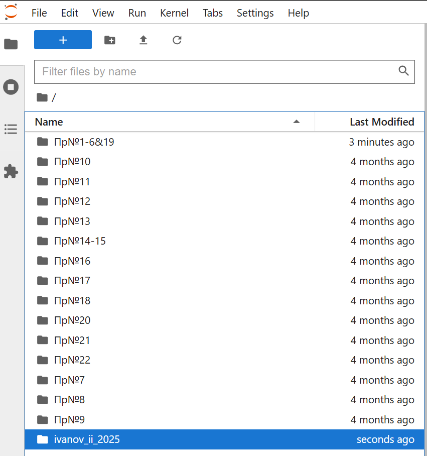
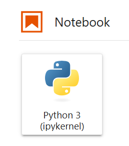
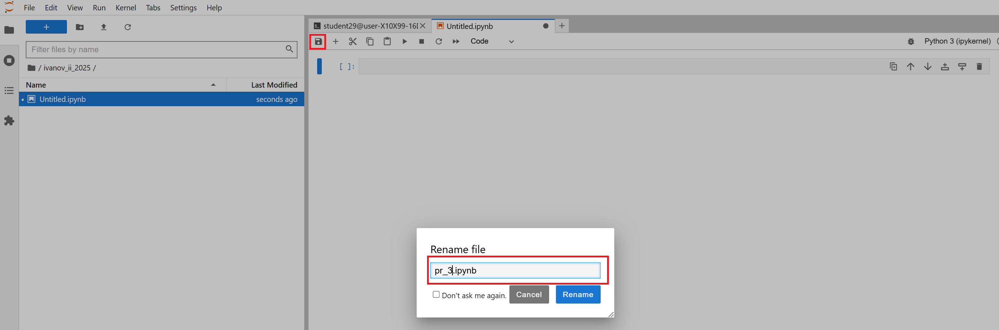

# Практическая работа №3: Знакомство с Python

---

## 🎯 Цель работы

Приобрести практические навыки в области создания интеллектуальных систем с использованием современных средств разработки на Python

---

## ⚠️ Важно

Это первая работа в формате **Notebook-based**. Вам будет доступен **ИИ-ментор** (`%%ask_mentor`). Все запросы логируются.

---

## 📚 Основные идеи и теоретические основы.

Одним из наиболее распространенных средств создания AI-систем является язык программирования Python. 
Стоит учитывать наличие значительного количества сред программирования для данного ЯП. 
Наиболее распространенные:
  - Python Idle – стандартная среда программирования, не требует значительных ресурсов, используется для отладки программ «на месте» (например, в различных micro-PC таких как Raspberry Pi, Orange Pi и т.д.);
  - Spyder – более функциональная среда по сравнению с Python Idle, используется для разработки и первично отладки программ на языке Python;
  - Jupyter Notebook – среда разработки, апробации и первичной отладки алгоритмов интеллектуальной обработки данных (например, апробации различных вариантов искусственных НС для последующего встраивания их в общую программу).
Для использования всех указанных выше инструментов необходимо установить дистрибутив языков программирования Python и R, включающий набор популярных свободных библиотек, объединённых проблематиками науки о данных и машинного обучения.
Текст программ в Jupyter Notebook разделен на блоки.
Каждый блок выполняется отдельно – для этого нажимается сочетание клавиш Shift + Enter.
После выполнения блока ему присваивается номер (```In [1]```) и автоматически создается новый блок (также его можно создать кнопкой ```+``` в верхней панели инструментов).
Результат сохраняется в оперативной памяти.
Можно вернуться к выполненному блоку и выполнить его повторно, переменные, использованные в перезапущенном блоке, обновятся (только они).
Разделение на блоки удобно, когда требуется провести анализ обработки одних и тех же данных различными алгоритмами.
Очистка оперативной памяти для данной программы производится кнопкой перезагрузки ядра ```Restart the kernel```.


---

## 📁 Материалы и методы

- Операционная система - [Ubuntu 22.04](https://help.ubuntu.ru/wiki/командная_строка)
- Язык программирования – [python](https://www.python.org/).
- Основные технологии:
  -  [jupyter Notebook](https://jupyter.org/).
- Основные библиотеки:
  - [matplotlib](https://matplotlib.org/)
  - [numpy](https://numpy.org/)
 
---

## 🧪 Программа работы 

---

### ⚙️ Настройка среды  

**Авторизоваться на сервере [Jupyter-Hub](https://jupyter.org/hub) по адресу [Jupyter-Hub-ИИСТ-НПИ](http://89.110.116.79:7998/)**


**С помощью файлового навигатора, расположенного слева перейти в свой каталог (ФИО и год), созданный ранее (двойным нажатием мыши)**



**Создать новую вкладку символом +**


**Выбрать тип новой вкладки -- Notebook**



**Сохранить / переименовать файл**



**Работать в новой вкладке вида**


---


### 📌 Выполнение простейшей последовательности команд

  - Импортируем библиотеки:
  ```python
  import matplotlib.pyplot as plt
  import numpy as np
  ```
  - Создаем numpy-массив размеров 2х3
  ```python
  x = np.array([[1,2,3], [4,5,6]])
  ```
  - Выводим значения массива с переносом строк
  ```python
  print("x:\n{}".format(x))
  ```
  - Проверяем наличие дополнительных библиотек (должно выполниться без ошибок)
  ```python
  import pandas as pd
  import sklearn as skl
  ```
  - Создаем массив случайных чисел размером 15х2
  ```python
  arr = np.random.rand(15,2)
  ```
  - Выводим случайные значения в виде графика на экран:
  ```python
  plt.figure(figsize=(20,5)) # создание холста размером 20х5
  plt.xlabel('Номер точки') # обозначение оси х
  plt.ylabel('Уровень')  # обозначение оси y
  plt.plot(arr) # вывод графика на экран
  ```
---

## 📌 Подготовить отчет о выполненной работе
В т.ч. ответить на следующие вопросы:
  - Что такое Anaconda и Jupyter Notebook?
  - Какое назначение имеют библиотеки numpy, pandas, matplotlib, scikit-learn?
