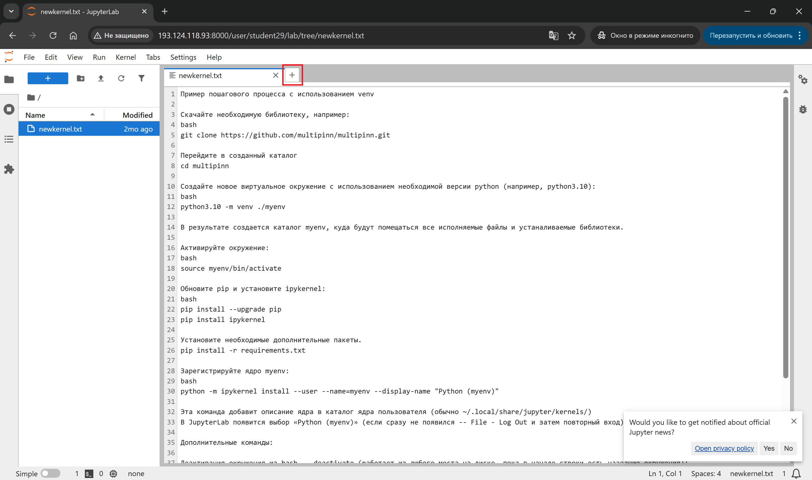
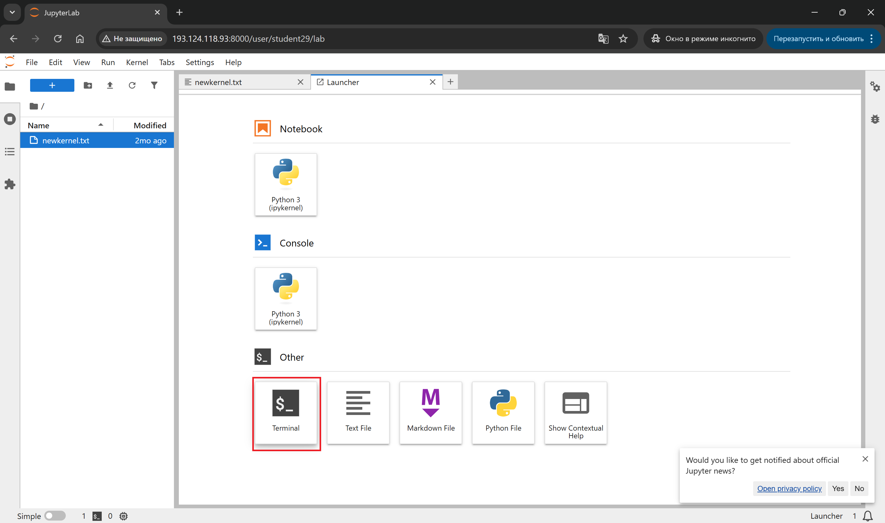
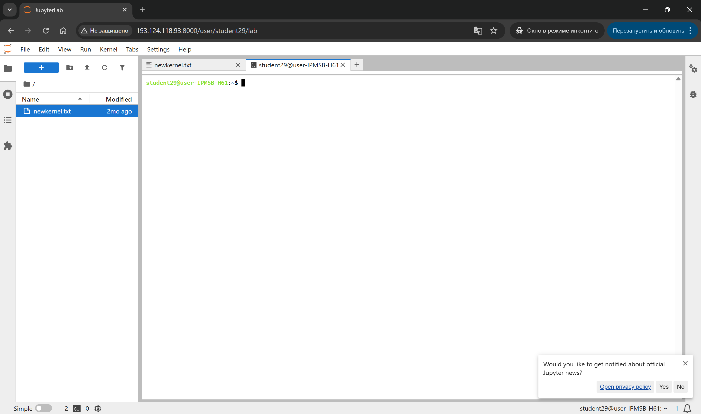

# !Ввиду изменения правил создания ботов Max работа не выполняется! Можно изучить теорию. Готовить отчет не требуется! 

***Изменение сути работы находится в проработке***

# Практическая работа №4 Основы контейнеризации и чат-боты для мессенджера MAX

---

## 🎯 Цель работы.

Создание сервера с постоянно работающим чат-ботом для мессенджера MAX в Docker-контейнере

---

## 📁 Материалы и методы

- Операционная система - [Ubuntu 22.04](https://help.ubuntu.ru/wiki/командная_строка)
- Язык программирования – [Python](https://www.python.org/).
- Основные библиотеки:
  - [Git](https://habr.com/ru/articles/541258/).
  - [Docker](https://www.docker.com/).
  - [maxapi](https://pypi.org/project/maxapi/) — библиотека для создания ботов MAX

---

## 🧪 Программа работы

---

### ⚙️ Настройка среды

**Авторизоваться на сервере [Jupyter-Hub](https://jupyter.org/hub) по адресу `http://<server-ip>:8000/`**


**Подготовить файл для отчета**

В файловом навигаторе (левая часть поля JupyterLab) необходимо
- зайти в каталог `project` -> `reports` (двойной клик мыши на названии каталога)
- создать новый каталог `Pr_4`,
- создать в `Pr_4` MarkDown-файл, сохранить его в `project/reports/Pr_4` под именем `Pr_4_report.md`; данный файл будет использован для формирования отчета
  - для создания нужно в правой части окна JupyterLab создать новую вкладку **Launcher** и выбрать тип файла `MarkDown File`
  - для сохранения нужно нажать на клавиатуре `Ctrl+S` и ввести имя файла `Pr_4_report.md`
- в левом меню вернуться в `project`, открыть в нем **Terminal**; данная вкладка будет использована только для выгрузки отчета на сервер GitLab
  - переход на уровень выше осуществляется одинарным щелчком по имени каталога, размещенном над файловым менеджером в левой части JupyterLab
  - для открытия вкладки типа **Terminal** нужно нажать символ **+** в правой части JupyterLab и выбрать **Terminal**

**В левом меню вернуться в корневой каталог `~` (на уровень выше `project`) и создать новую вкладку символом +**



**Выбрать тип новой вкладки -- Terminal**



**Работать в новой вкладке вида**



**Создать каталог с именем, соответствующим Вашим ФИО и году обучения, например:**

```bash
mkdir ivanov_ii_2026
```

**Перейти в новый каталог**

```bash
cd ivanov_ii_2026
```

---

### 📌 Создание бота

  - Проверяем работу python3.10
  ```bash
  python3.10
  ```
  - Выходим
  ```python
  exit()
  ```
  - Для того, чтобы не нарушать структуру базового python, не мешать своими установками администраторам серверов и коллегам, создаем «окружение» *python3.10 env* и [активируем его](https://netpoint-dc.com/blog/python-venv-ubuntu-1804/)
  ```bash
  python3.10 -m venv env
  source env/bin/activate
  ```
  - В результате в начале командной строки появляется указание на использование окружения ```(env) ...:~/ivanov_ii_2026$```
  - Устанавливаем необходимые pip-пакеты, в частности, нам понадобится библиотеку maxapi
  ```bash
  pip install maxapi
  ```
  - Создаем собственную учетную запись – нового бота для мессенджера MAX, как это указано в [статье на Хабре](https://habr.com/ru/articles/930230/)). 
  - Получаем токен, его будет достаточно для работы простейшего приложения. Задаем его в качестве переменной командной строки, например:
  ```bash
  TOKEN="abcdef12345"
  ```
  - Вносим текст программы:
  ```bash
  cat << 'PYEOF' > bot.py
  import asyncio
  import logging
  
  from maxapi import Bot, Dispatcher, F
  from maxapi.types import MessageCreated
  
  logging.basicConfig(level=logging.INFO)
  
  bot = Bot('$TOKEN')
  dp = Dispatcher()
  
  
  @dp.message_created(F.message.body.text)
  async def echo(event: MessageCreated):
      await event.message.answer(f"Повторяю: {event.message.body.text}")
  
  
  async def main():
      await dp.start_polling(bot)
  
  
  if __name__ == '__main__':
      asyncio.run(main())
  PYEOF
  ```
  - Запускаем программу:
  ```bash
  python bot.py
  ```
  - 📌 Проверяем работу бота, отправляя ему сообщение в MAX.
  
  - 📌 Настраиваем работу собственной python-программы в виде docker-контейнера с автозапуском после старта ОС:
    - Отключаем python env, так как теперь в качестве закрытого окружения будет docker-контейнер:
    ```bash
    deactivate
    ```
    - Создаем файл requirements.txt со списком pip-библиотек, необходимых для работы нашей программы
    ```bash
    nano requirements.txt
    ```
    - Вводим следующее содержимое:
    ```bash
    maxapi
    ```
    - Cохраняем файл ```Ctrl+O```, выходим ```Ctrl+X```.
    - Создаем файл для сборки docker образа
    ```bash
    nano Dockerfile
    ```
    - Вводим следующее содержание (multi-stage build):
    ```dockerfile
    FROM python:3.10 AS builder
    
    COPY requirements.txt .
    RUN pip install --user -r requirements.txt
    
    FROM python:3.10-slim
    WORKDIR /code
    COPY --from=builder /root/.local /root/.local
    COPY ./bot.py .
    ENV PATH=/root/.local:$PATH
    CMD ["python", "-u", "./bot.py"]
    ```
    - Cохраняем файл ```Ctrl+O```, выходим ```Ctrl+X```.

*ПРИМЕЧАНИЕ* Следует обратить внимание на версию python: указанная в данном примере соответствует python, установленном на сервере.

Eсли Вы используете свой сервер, но следует указать версию, установленную на нем, например, для Debian 12 по умолчанию устанавливается python:3.11

- Собираем docker образ с именем – номером Вашей зачётки
```bash
docker build -t <номер_зачетки> .
```
- Запускаем *docker* образ в режиме работы в фоне (*-d*)
```bash
docker run -d <номер_зачетки>
```
- Проверяем, что в ответ на данную команду, docker сообщит CONTAINER ID вида
```bash
5df687ebc2f6380abd23e4ac5f7899c5f9a8a0e414cfa633ffefb0c372e40fcd
```
- Также данный CONTAINER ID можно понять из списка, выдаваемого в ответ на команду:
```bash
docker ps -a
```
- Пример ответа:
```bash
CONTAINER ID   IMAGE          COMMAND                CREATED              STATUS              PORTS     NAMES
5df687ebc2f6       000000           "python -u ./bot.py"     About a minute ago Up About a minute                bold_bhabha
```
- В данном случае CONTAINER ID значительно короче; можно пользоваться любым номером. Например, для просмотра log'ов (в данном случае - результатов работы функций "print(" программы):
```bash
docker logs <CONTAINER ID>
```
  - Пример ответа:
  ```bash
  INFO:root:Bot started
  INFO:maxapi:Polling started
  ```
- Пример ответа:
```bash
INFO:root:Bot started
INFO:maxapi:Polling started
```
- Останавливаем контейнер (**нужно вставить свой *CONTAINER ID* вместо `<CONTAINER ID>`, определенный по номеру зачетки из общего списка):
```bash
docker stop <CONTAINER ID>
```
- Удаление контейнера (опять же **нужно вставить свой *CONTAINER ID* вместо `<CONTAINER ID>`, определенный по номеру зачетки из общего списка):
```bash
docker rm <CONTAINER ID>
```
- Удаление образа image (**нужно вставить свой *номер зачетки* вместо `<номер зачетки>`):
```bash
docker rm <номер зачетки>
```

---

## 📌 Отчёт о выполненной работе

Выполняется в созданном ранее файле `~/project/reports/Pr_4/Pr_4_report.md`

1. Вставьте все команды, введенные в командную строку и ответы Terminal
2. Добавьте комментарии по выполненной работе
3. Подготовьте и впишите в конец файла ответы на контрольные вопросы из раздела «Контрольные вопросы» (находятся в конце данных методических указаний)
4. Сохраните в `reports/Pr_4/Pr_4_report.md`
5. Загрузите в репозиторий и отправьте:

```bash
git add . && git commit -m "Pr_4 report" && git push
```

> 📖 Используйте [справочник по Markdown](./MD_Instructions.md) для оформления.

> ⏳ Оценка запустится автоматически в GitLab CI. Результат появится в разделе **CI/CD → Pipelines**.
---

## Контрольные вопросы

1. Зачем при подготовке окружения создают виртуальное окружение `venv`?
2. Почему `requirements.txt` нужен в Dockerfile?
3. Что дает multistage build: установка зависимостей в одном этапе и копирование результата в финальный образ?
4. Как проверить, что чат-бот запущен в контейнере и реально отвечает?
