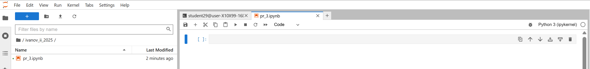
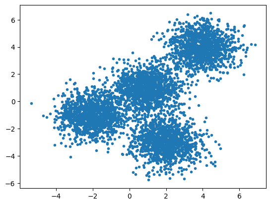
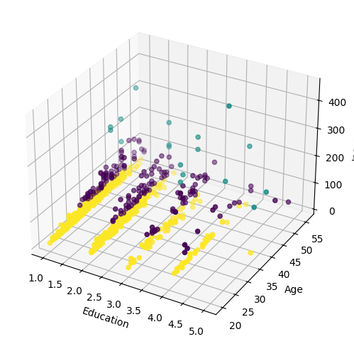

# Практическая работа №7 Машинное обучение. K‑Means Clustering

---

## 🎯 Цель работы.

Получить теоретические знания и практические навыки постановки и решения задачи кластеризации методом K‑Means

## 📚 Основные идеи и теоретические основы.

📚 Кластеризация (или кластерный анализ) — это процесс группировки объектов или данных в подмножества (кластеры), 
при котором объекты внутри одного кластера максимально похожи друг на друга по определенным критериям, 
а объекты из разных кластеров — максимально отличаются. 

📚 Это метод "машинного обучения без учителя", используемый для выявления скрытой структуры данных. 
Кластеризация применяется в маркетинге, медицине, финансах и других областях для сегментации клиентов, группировки заболеваний или анализа данных. 

Существует множество моделей кластеризации. В этой практической рабое мы используем модель, которая считается одной из самых простых. 
Несмотря на свою простоту, алгоритм K‑Means (k-средних) широко используется для кластеризации во многих приложениях науки о данных, особенно полезен, если вам нужно быстро извлечь ценную информацию из немаркированных данных. 

📚 Некоторые практические применения метода k-средних:

  - Сегментация клиентов
  - Понять с какой целью действуют посетители веб-сайта
  - Распознавание образов
  - Сжатие данных

В этой практической работе мы практикуем кластеризацию по методу k-средних на двух примерах:

  - Тестовая задача применения k-средних на случайно сгенерированный набор данных
  - Использование k-средних для сегментации клиентов

Алгоритм разбивает множество векторных пространств на заранее известные элементы числа кластеров k.
Принцип действия алгоритма таков, что он стремится минимизировать суммарное квадратичное отклонение точек кластеров от центров этих кластеров. 

📚 Основная идея заключается в том, что:
  - сначала определяется (например, случайно) столько _центров кластеров_, сколько их ожидает пользователь
  - затем определяется _евклидово расстояние_ от каждой точки до _центров кластеров_ и принадлежность каждой точки к тому или иному кластеру (к какому ближе - к тому и относится)  
  - вычисляются _центры масс_ для каждого кластера и они назначаются _новыми центрами кластеров_  
  - _центры масс_ используются для определения отношения точек к тому или иному кластеру.

Алгоритм завершается, когда на какой-то итерации не происходит изменений положения центров кластеров (оно становится меньше некоторой малой величины). 
Это происходит за конечное число итераций.

---

## 📁 Материалы и методы

- Операционная система - [Ubuntu 22.04](https://help.ubuntu.ru/wiki/командная_строка)
- Язык программирования – [python](https://www.python.org/).
- Основные технологии:
  -  [jupyter Notebook](https://jupyter.org/).
- Основные библиотеки:
  - [matplotlib](https://matplotlib.org/)
  - [numpy](https://numpy.org/)
  - [scikit-learn](https://scikit-learn.org/)
  - [pandas](https://pandas.pydata.org/)
- Датасеты:
  - генератор синтетических изотропных гауссовых пятен [sklearn.datasets.make_blobs](https://scikit-learn.org/stable/modules/generated/sklearn.datasets.make_blobs.html)
  - специальный датасет ["Customer Segmentation"](https://www.kaggle.com/datasets/yashgupta011/customer-segmentation-dataset)
 
---

## 🧪 Программа работы 

---

### ⚙️ Настройка среды  

**Авторизоваться на сервере [Jupyter-Hub](https://jupyter.org/hub) по адресу [Jupyter-Hub-ИИСТ-НПИ](http://89.110.116.79:7998/)**

**С помощью файлового навигатора, расположенного слева перейти в свой каталог (ФИО и год), созданный ранее (двойным нажатием мыши)**

**Создать новую вкладку символом +**

**Выбрать тип новой вкладки -- Notebook**

**Сохранить / переименовать файл**

**Работать в новой вкладке вида**



**Импорт необходимых библиотек**

```python
import random 
import numpy as np 
import matplotlib.pyplot as plt 
from sklearn.cluster import KMeans 
from sklearn.datasets import make_blobs 
%matplotlib inline
import pandas as pd
```

---

### 🧪 k-средних на случайно сгенерированном наборе данных

1. 🧪 **Генерация набора случайных данных**
  - Задаем _центр отсчета_ для всех генерируемых случайных значений
    ```python
    np.random.seed(0)
    ```
  - Создадим случайные кластеры точек с помощью класса ```make_blobs```.
  Класс ```make_blobs``` может принимать множество входных данных, но мы будем использовать только следующие:
    - ```n_samples``` - общее количество точек, поровну распределенных между кластерами, зададим на уровне *5000*
    - ```centers``` - координаты центров кластеров, одновременно задает количество кластеров, задается в виде массива, например, ```[[4, 4], [-2, -1], [2, -3],[1,1]]```
    - ```cluster_std``` - разброс точек относительно центра, одновременно определяет случайный закон распределения этих точек (стандартное отклонение), задаем в виде числа, например, _0,9_
  - Выходными значениями ```make_blobs``` будут:
    - **X** - _матрица признаков_, массив размером ```[n_samples, n_features]``` (где ```n_features``` - количество осей пространства), в котором располагаются точки (в нашем случае используется плоское двумерное пространство, т.е. ```n_features=2```)
    - **Y** - _вектор меток_, массив размером ```[n_samples]``` (вектор), в котором располагаются целочисленные метки, сообщающие о принадлежности каждой точки массива **X** к тому или иному кластеру; данный вектор необходим для проверки, на сколько хорошо отработал наш алгоритм
    ```python
    X, y = make_blobs(n_samples=5000, centers=[[4,4], [-2, -1], [2, -3], [1, 1]], 
                      cluster_std=0.9)
    ```
  - Посмотрим диаграмму рассеяния точек на плоскости:
    ```python
    plt.scatter(X[:, 0], X[:, 1], marker='.')
    ```


2. 🧪 **Настройка (обучение) модели K-Means**
  - Используем класс [KMeans](https://scikit-learn.org/stable/modules/generated/sklearn.cluster.KMeans.html).
  Он имеет множество параметров, которые можно использовать, но мы будем использовать эти три:
    - **init** - метод инициализации центроидов, будем использовать ```k-means++```, он выбирает начальные центры кластеров _неслучайно_ (в отличие от ```random```), что часто ускоряет поиск (сходимость); кроме того, именно в библиотеке scikit-learn реализован _жадный k-means++_, который отличается от обычного тем, что на каждом шаге выборки выполняется несколько попыток, и среди них выбирается лучший центроид
    - **n_clusters** - количество кластеров, которые необходимо искать; предположим, что мы знаем (хотя обычно разработчик не знает): таких центров 4
    - **n_init** - количество запусков алгоритма k-средних с различными начальными центрами; конечный результат будет выбран, как наилучший из **n_init** последовательных запусков; выбор данного значения зависит от выбора **init** и данных: если данные разреженные (```cluster_std``` ближе к 1), то число должно быть больше, если плотные - меньше; для **init**=k-means++ и плотных данных достаточно 1, а для **init**=random, лучше выставить 10, а можно выставить ```auto```
  - Инициализируем объект k_means, как экземпляр класса KMeans:
    ```python
    k_means = KMeans(init = "k-means++", n_clusters = 4, n_init = 'auto')
    ```
  - Обучаем модель KMeans на матрице признаков **X**, которую мы создали выше (**Y** не используем, поэтому это метод обучения _без учителя_)
    ```python
    k_means.fit(X)
    ```
  - Сохраним в отдельной переменной k_means_labels метки для каждой точки модели, используя атрибут .labels_ KMeans, и выведем их на экран
    ```python
    k_means_labels = k_means.labels_
    k_means_labels
    ```
  - Получим координаты центров кластеров с помощью .cluster_centers_ KMeans и сохраним их как k_means_cluster_centers
    ```python
    k_means_cluster_centers = k_means.cluster_centers_
    k_means_cluster_centers
    ```
  - Построим диаграмму с нашими ответами
    ```python
    fig = plt.figure(figsize=(6, 4)) 
    colors = plt.cm.Spectral(np.linspace(0, 1, len(set(k_means_labels))))
    ax = fig.add_subplot(1, 1, 1)
    for k, col in zip(range(len([[4,4], [-2, -1], [2, -3], [1, 1]])), colors):
      my_members = (k_means_labels == k)
      cluster_center = k_means_cluster_centers[k]
      ax.plot(X[my_members, 0], X[my_members, 1], 'w', markerfacecolor=col, marker='.')
      ax.plot(cluster_center[0], cluster_center[1], 'o', markerfacecolor=col, markeredgecolor='k', markersize=6)
    ax.set_title('KMeans')
    ax.set_xticks(())
    ax.set_yticks(())
    plt.show()
    ```

--- 

### 📌 Задание №1

- Попробуйте кластеризовать указанный выше набор данных в 3 кластера (не генерируйте данные заново, используйте тот же набор данных, что и выше)
- Попробуйте использовать **init** = ```random``` с различными значениями **n_init**

---

### 🧪 Сегментация клиентов с помощью K-Means

Представьте себе, что у вас есть набор данных о клиентах, и вам нужно применить к ним сегментацию -- разделить их на группы, например, чтобы потом, по новому поведению одного члена какой-то группы предсказать, что остальные могут повести себя также в блажайшее время. 
Сегментация клиентов — это метод разбиения клиентской базы на группы людей со схожими характеристиками. 
Это важная стратегия, позволяющая бизнесу ориентироваться на эти конкретные группы клиентов и эффективно распределять маркетинговые ресурсы. 
Одна группа может включать клиентов с высокой прибылью и низким уровнем риска, то есть тех, кто с большей вероятностью приобретет товары или подпишется на какую-либо услугу. 
Задача бизнеса — удержать таких клиентов. 
Другая группа может включать клиентов из некоммерческих организаций. И так далее.
Представьте, что у вас есть набор данных о клиентах, и вам необходимо применить сегментацию клиентов по этим историческим данным. 
Сегментация клиентов — это практика разделения клиентской базы на группы людей по состоянию здоровь. 
Это важная задача, поскольку бизнес может ориентироваться на конкретные группы клиентов и под каждую использовать те или иные маркетинговые подходы. 

1. 🧪 **Загружаем данные из CSV-файла**

```python
cust_df = pd.read_csv("/home/jupyter/work/data/Cust_Segmentation.csv")
cust_df.head()
```

2. 🧪 **Предварительная обработка**

В полученных данных есть **Address** - текстовая переменная, которую также можно назвать дискретной (принимает конкретные значения из некоторого списка).
Алгоритм k-средних не применим напрямую к таким переменным, поскольку функция евклидова расстояния не имеет смысла для дискретных переменных.
Поэтому давайте отбросим этот столбец прежде чем выполнять кластеризацию.

```python
df = cust_df.drop('Address', axis=1)
df.head()
```

3. 🧪 **Нормализация по стандартному отклонению**

Теперь нормализуем набор данных.
Зачем нужна нормализация?
Нормализация — это статистический метод, который помогает математическим алгоритмам одинаково интерпретировать признаки с разными амплитудами и распределениями.
Наши данные имеют существенно различные крайние значения (амплитуды) - есть данные в пределах от 1 до 2, есть от 0 до 253.
Для нормализации набора данных мы используем функцию [StandardScaler](https://scikit-learn.org/stable/modules/generated/sklearn.preprocessing.StandardScaler.html)
```python
from sklearn.preprocessing import StandardScaler
X = df.values[:,1:]
X = np.nan_to_num(X)
Clus_dataSet = StandardScaler().fit_transform(X)
Clus_dataSet
```

4. 🧪 **Создание модели**

Если бы у нас не было доступа к алгоритму k-средних, создание модели, которая бы описала наш набор данныз заняло бы продолжительное время.
Мы бы составляли модели вручную, эмпрически предполагая, что каждая группа клиентов будет иметь определённый возраст, доход, образование и т. д., и проверяя разделение между этими группами с помощью множества тестов и экспериментов.
Однако, используя кластеризацию k-средних, мы можем значительно упростить этот процесс.

```python
clusterNum = 3
k_means = KMeans(init = "k-means++", n_clusters = clusterNum, n_init = 12)
k_means.fit(X)
labels = k_means.labels_
print(labels)
```

Дополнительно:
  - присваиваем каждой строке в фрейме данных метки
    ```python
    df["Clus_km"] = labels
    df.head(5)
    ```
  - посмотрим значения центров кластеров, усредняя признаки в каждом кластере
    ```python
    df.groupby('Clus_km').mean()
    ```
    
5. 🧪 **Анализ модели**
  - Посмотрим на распределение клиентов по возрасту и доходу
    ```python
    area = np.pi * ( X[:, 1])**2  
    plt.scatter(X[:, 0], X[:, 3], s=area, c=labels.astype(float), alpha=0.5)
    plt.xlabel('Age', fontsize=18)
    plt.ylabel('Income', fontsize=16)
    
    plt.show()
    ```


  - Посмотрим на распределение клиентов по трем параметрам - образованию, возрасту и доходу
    ```python
    fig = plt.figure(1, figsize=(8, 6))
    plt.clf()
    ax = fig.add_subplot(111, projection='3d')
    plt.cla()
    ax.set_xlabel('Education')
    ax.set_ylabel('Age')
    ax.set_zlabel('Income')
    
    ax.scatter(X[:, 1], X[:, 0], X[:, 3], c= labels.astype(float))
    ```

--- 

### 📌 Задание №2

Проведите анализ полученного трехмерного графика, сделайте выводы об основном признаке, который отличает друг от друга кластеры

### 📌 Подготовить отчет о выполненных Заданиях
